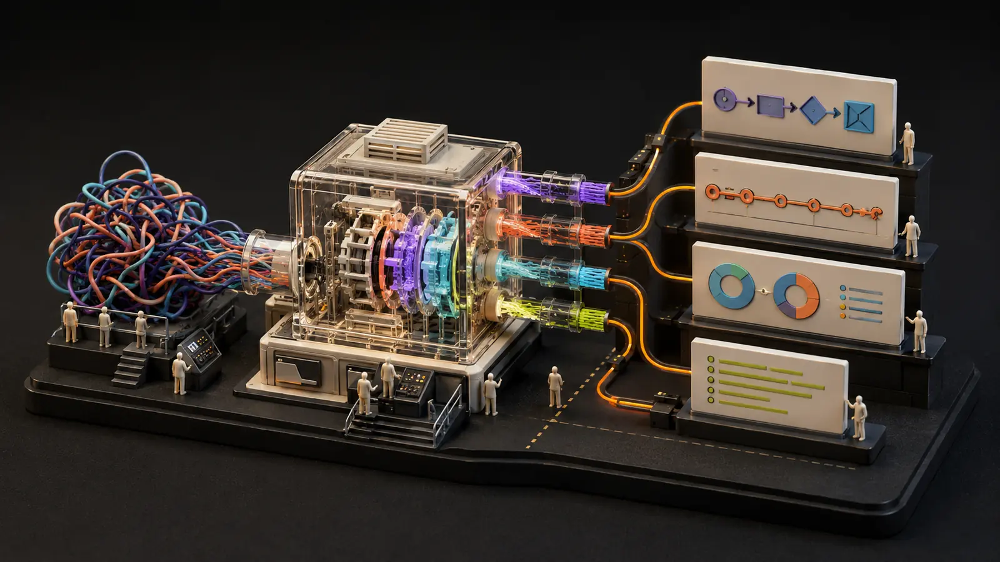
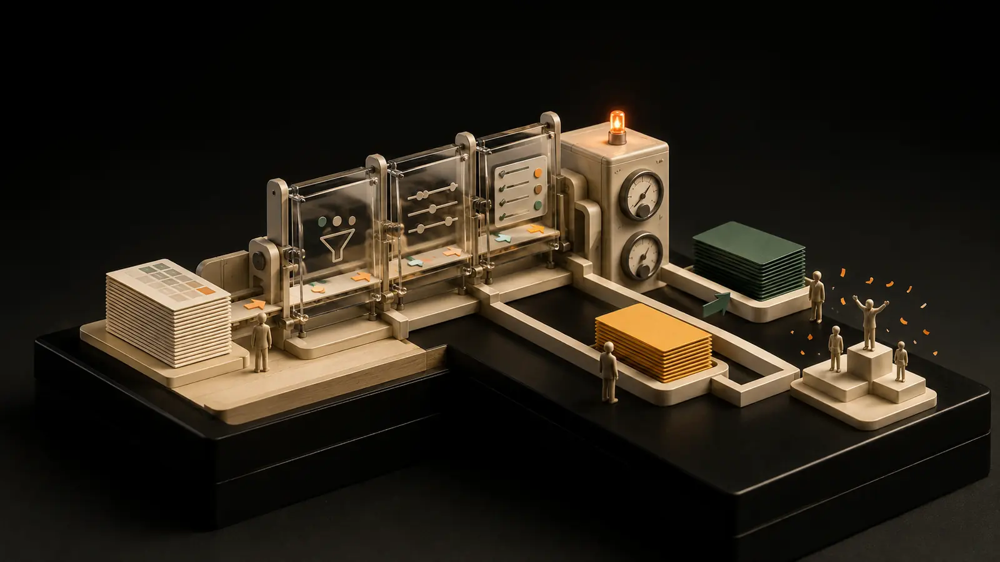

# AI Builds Showcase

I build practical tools that make complicated work clearer and easier to use.

*Five working models. Five different problems. One build-test-improve process.*

Every project here goes beyond a first answer: I build it, test it, debug it, deploy it, and learn from the result.

## Live builds

<table>
  <tr>
    <td colspan="2">
      
       
      <strong><a href="./memory-city">Memory City</a></strong>
       
      Turns notes into a 3D city where buildings are ideas and roads show connections.
       
      <a href="https://memory-city.recruiting-gains.workers.dev/"><strong>Open live build ↗</strong></a> · <a href="./memory-city">Read how it works</a>
    </td>
  </tr>
  <tr>
    <td width="50%">
      
       
      <strong><a href="./explain-it-visually">Explain It Visually</a></strong>
       
      Turns written explanations into editable visuals you can download.
       
      <a href="https://explain-it-visually.recruiting-gains.workers.dev/"><strong>Open live build ↗</strong></a> · <a href="./explain-it-visually">Read how it works</a>
    </td>
    <td width="50%">
      
       
      <strong><a href="./ai-workflow-lab">AI Workflow Lab</a></strong>
       
      Turns meeting notes or one rough idea into useful, structured output.
       
      <a href="https://ai-workflow-lab.recruiting-gains.workers.dev/"><strong>Open live build ↗</strong></a> · <a href="./ai-workflow-lab">Read how it works</a>
    </td>
  </tr>
  <tr>
    <td width="50%">
      
       
      <strong><a href="./no-megaphone">NO MEGAPHONE</a></strong>
       
      Helps decide whether experience would improve a public conversation—or whether staying quiet is better.
       
      <a href="https://no-megaphone.recruiting-gains.workers.dev/"><strong>Open live build ↗</strong></a> · <a href="./no-megaphone">Read how it works</a>
    </td>
    <td width="50%">
      
       
      <strong><a href="./chatgpt-ads">ChatGPT Ads</a></strong>
       
      Checks exported campaign data with clear rules and shows what needs attention. No AI model is used.
       
      <a href="https://chatgpt-ads.recruiting-gains.workers.dev/"><strong>Open live build ↗</strong></a> · <a href="./chatgpt-ads">Read how it works</a>
    </td>
  </tr>
</table>

## How I build

> **Plan → Build → Test → Debug → Deploy → Learn**

The goal is not to collect unfinished demos. Each project is a working experiment with a public interface, clear limits, and enough documentation for someone else to understand the decisions behind it.

## What this portfolio shows

- **Product judgment:** each build starts with a real problem and a narrow promise.
- **Full-stack execution:** interfaces, APIs, data handling, testing, and deployment.
- **Responsible AI use:** structured outputs, validation, privacy boundaries, and human review.
- **Clear communication:** plain-English explanations before technical detail.
- **Iteration:** every result becomes feedback for the next build.

## Independence

These are independent, original projects. They are not affiliated with GitHub, Cloudflare, OpenAI, or any other product shown or discussed.

The repository's [MIT License](./LICENSE) applies unless a project says otherwise.
