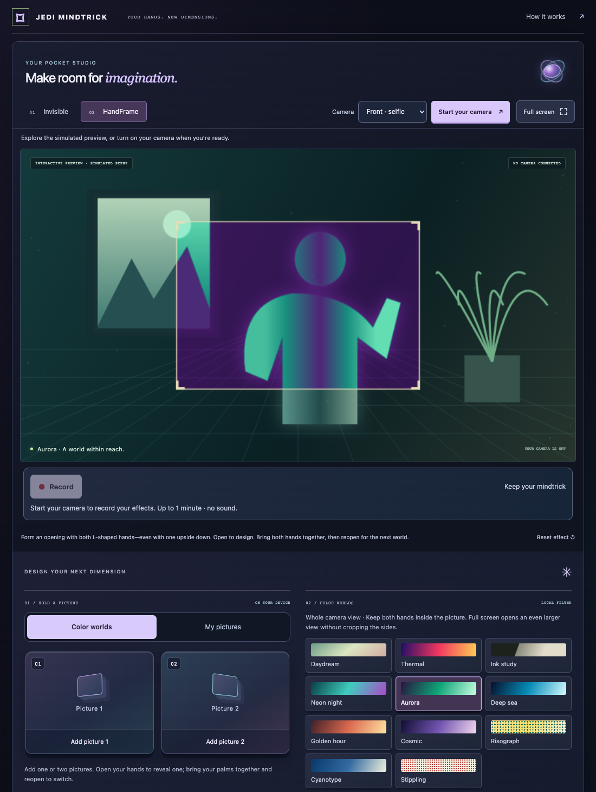
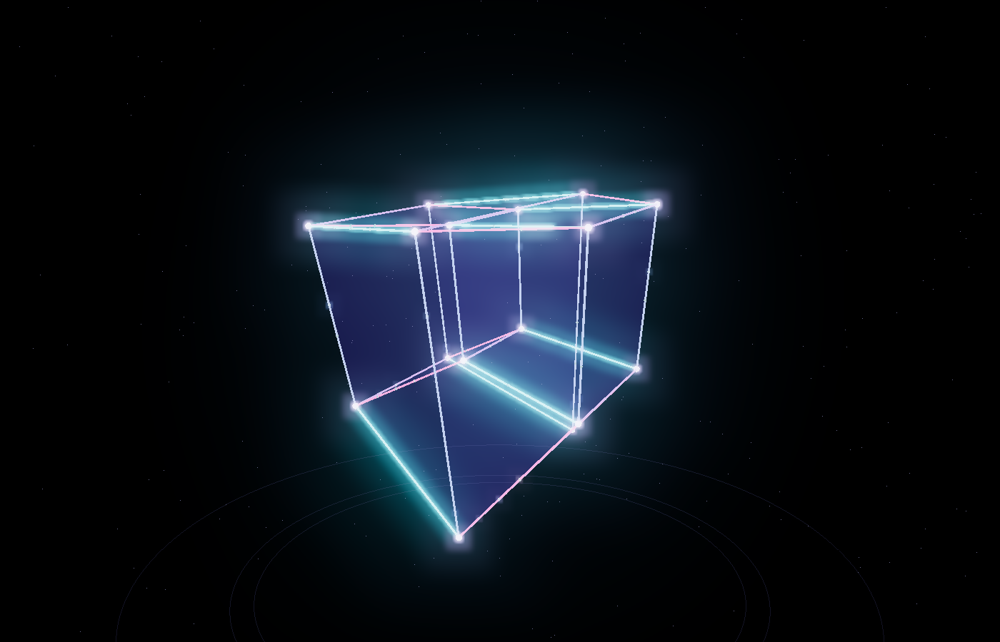

# AI Builds Showcase

I build practical tools that make complicated work clearer and easier to use.

*A growing collection of working models. Different problems. One build-test-improve process.*

Every project here goes beyond a first answer: I build it, test it, debug it, deploy it, and learn from the result.

## Desktop tools

### Agent Office

A cozy animated office for project activity. Choose among five rooms, switch floors, and inspect little robot coworkers. A Mac menu-bar companion keeps the office nearby.

**Experimental preview:** the playable demo uses labeled sample activity. The private local adapter is tested, but automatic connection to the current Codex desktop session is not yet verified. No task conversations are published.

[Explore the source and setup](./agent-office) · [See what was tested](./agent-office/docs/VERIFICATION.md)

<table>
  <tr>
    <td width="40%">
      
    </td>
    <td>
      <strong><a href="./codex-usage-bar-red">Codex Usage Bar Red</a></strong>
        
      Know how much Codex allowance you have left—right above your keyboard. Red Touch Bar and menu-bar indicators show your real allowance, reset times, and a warning when a reading is out of date.
        
      An MIT-licensed adaptation of <a href="https://github.com/yizhigou/codex-usage-bar">yizhigou’s Codex Usage Bar</a>, with a red theme, corrected allowance labels, and reliability improvements. Real hardware photo; no simulated interface.
        
      <a href="https://github.com/recruiting-gains/ai-builds-showcase/releases/tag/codex-usage-bar-red-v2.1.1"><strong>Download for Mac ↗</strong></a> · <a href="./codex-usage-bar-red">Setup &amp; source</a> · <a href="./codex-usage-bar-red/docs/VERIFICATION.md">What was tested</a>
        
      Experimental desktop utility · Apple Silicon download · macOS 14+ · physical Touch Bar required for keyboard display · not Apple-notarized.
    </td>
  </tr>
</table>

## Live builds

### Jedi Mindtrick

A camera playground for your hands. Fade into a saved view of your room, or shape a moving window with your fingers—even with one L upside down—and explore eleven local color effects. Choose front or back camera, add up to two local pictures, and open your hands to enlarge a whole photo without squeezing it. The back camera also offers an optional one-palm reveal. Bring both palms together, then reopen to switch pictures or colors; in one-hand mode, use Next picture. A small cue shows when the two-hand gesture is ready.

Live hand tracking and color effects run on your device. An optional, separately submitted still can use Cloudflare AI. A dimensional violet and blue dashboard works on your phone or computer; fullscreen keeps the camera view clear. Record a short clip of your effects and save or share it from your browser. The preview above uses a simulated scene, and tracking quality varies with the camera and lighting.

[**Open live build ↗**](https://jedi-mindtrick.recruiting-gains.workers.dev/) · [Source & phone setup](./jedi-mindtrick) · [What was tested](./jedi-mindtrick/docs/VERIFICATION.md)

<table>
  <tr>
    <td colspan="2">
      
       
      <strong><a href="https://cruz-hypercube.cg-stackd.chatgpt.site/">HYPERCUBE — Fourth Dimension Lab</a></strong>
        
      Explore a four-dimensional cube through a glowing, interactive projection. Watch a square grow into a cube and then a tesseract, rotate through the fourth dimension, compare views, and switch to a full-screen cinematic experience.
        
      A customized adaptation of Tarek Sherif’s Tesseract Explorer, with a new interface, rendering system, dimensional sequence, and learning explanations. AI-assisted development; the live geometry runs locally in your browser without calling an AI model.
        
      <a href="https://cruz-hypercube.cg-stackd.chatgpt.site/"><strong>Open live build ↗</strong></a> · <a href="./hypercube">Read what it does</a>
    </td>
  </tr>
  <tr>
    <td colspan="2">
      
       
      <strong><a href="https://airframe.recruiting-gains.workers.dev/">Airframe</a></strong>
       
      A touchless workspace: point to aim, pinch to grab, and move panels with your hand. Hand tracking stays on your device; mouse, touch, and keyboard work too. Controls this website—not your whole computer.
       
      <a href="https://airframe.recruiting-gains.workers.dev/"><strong>Open live build ↗</strong></a> · <a href="./airframe">Read how it works</a> · <a href="./airframe/docs/TRACKING.md">Explore the gesture engineering</a>
    </td>
  </tr>
  <tr>
    <td colspan="2">
      
       
      <strong><a href="https://looplab.recruiting-gains.workers.dev/">LoopLab</a></strong>
       
      A playable prompt laboratory: compare two AI instructions on the same ten examples, inspect every answer, and keep the changes the evidence supports.
       
      <a href="https://looplab.recruiting-gains.workers.dev/"><strong>Open live build ↗</strong></a> · <a href="./looplab">Read how it works</a> · <a href="./looplab/docs/LOOP-METHOD.md">Explore the experiment loop</a>
    </td>
  </tr>
  <tr>
    <td colspan="2">
      
       
      <strong><a href="https://thenfold.recruiting-gains.workers.dev/">Thenfold</a></strong>
       
      A 3D rehearsal room for business changes: compare what is active with what is proposed, inspect the represented connections, and let a person decide what happens next.
       
      <a href="https://thenfold.recruiting-gains.workers.dev/"><strong>Open live build ↗</strong></a> · <a href="https://thenfold.recruiting-gains.workers.dev/how-it-works/">See how it works</a> · <a href="https://thenfold.recruiting-gains.workers.dev/available/">Available for licensed installation</a>
    </td>
  </tr>
  <tr>
    <td colspan="2">
      
       
      <strong><a href="./memory-city">Memory City</a></strong>
       
      Turns notes into a 3D city where buildings are ideas and roads show connections.
       
      <a href="https://memory-city.recruiting-gains.workers.dev/"><strong>Open live build ↗</strong></a> · <a href="./memory-city">Read how it works</a>
    </td>
  </tr>
  <tr>
    <td width="50%">
      
       
      <strong><a href="./explain-it-visually">Explain It Visually</a></strong>
       
      Turns written explanations into editable visuals you can download.
       
      <a href="https://explain-it-visually.recruiting-gains.workers.dev/"><strong>Open live build ↗</strong></a> · <a href="./explain-it-visually">Read how it works</a>
    </td>
    <td width="50%">
      
       
      <strong><a href="./ai-workflow-lab">AI Workflow Lab</a></strong>
       
      Turns meeting notes or one rough idea into useful, structured output.
       
      <a href="https://ai-workflow-lab.recruiting-gains.workers.dev/"><strong>Open live build ↗</strong></a> · <a href="./ai-workflow-lab">Read how it works</a>
    </td>
  </tr>
  <tr>
    <td width="50%">
      
       
      <strong><a href="./no-megaphone">NO MEGAPHONE</a></strong>
       
      Helps decide whether experience would improve a public conversation—or whether staying quiet is better.
       
      <a href="https://no-megaphone.recruiting-gains.workers.dev/"><strong>Open live build ↗</strong></a> · <a href="./no-megaphone">Read how it works</a>
    </td>
    <td width="50%">
      
       
      <strong><a href="./chatgpt-ads">ChatGPT Ads</a></strong>
       
      Checks exported campaign data with clear rules and shows what needs attention. No AI model is used.
       
      <a href="https://chatgpt-ads.recruiting-gains.workers.dev/"><strong>Open live build ↗</strong></a> · <a href="./chatgpt-ads">Read how it works</a>
    </td>
  </tr>
  <tr>
    <td colspan="2">
      
       
      <strong><a href="./mask-before-you-ask">Mask Before You Ask</a></strong>
       
      Finds common private details in text and replaces them before you share it with AI.
       
      <a href="https://mask-before-you-ask.recruiting-gains.workers.dev/"><strong>Open live build ↗</strong></a> · <a href="./mask-before-you-ask">Read how it works</a>
    </td>
  </tr>
</table>

## How I build

> **Plan → Build → Test → Debug → Deploy → Learn**

The goal is not to collect unfinished demos. Each project is a working experiment with a public interface, clear limits, and enough documentation for someone else to understand the decisions behind it.

## What this portfolio shows

- **Product judgment:** each build starts with a real problem and a narrow promise.
- **Full-stack execution:** interfaces, APIs, data handling, testing, and deployment.
- **Responsible AI use:** structured outputs, validation, privacy boundaries, and human review.
- **Clear communication:** plain-English explanations before technical detail.
- **Iteration:** every result becomes feedback for the next build.

## Independence

These are independent projects. Original builds and open-source adaptations are identified on their project pages, with attribution and license notices retained. They are not affiliated with GitHub, Cloudflare, OpenAI, or any other product shown or discussed.

The repository's [MIT License](./LICENSE) applies unless a project says otherwise.
