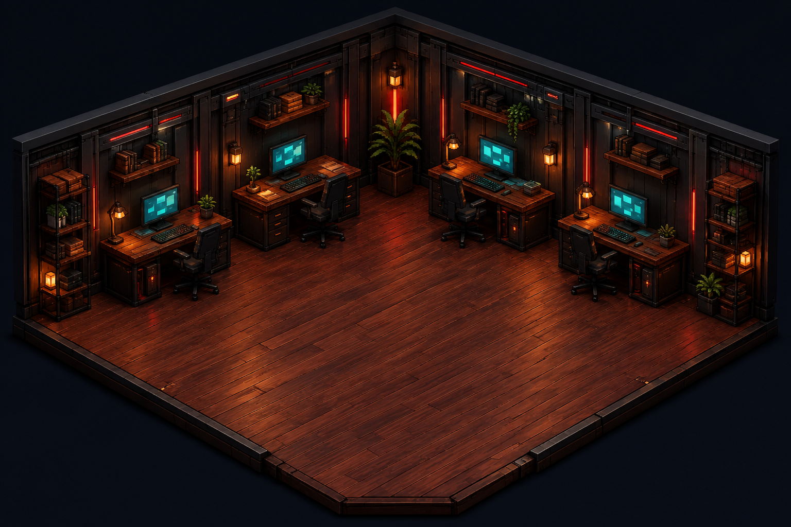

# Agent Office

**Your work, a little more alive.** A cozy, read-only office for project activity.



Choose a floor, meet its little robot coworkers, or zoom out to the whole building. Five original room layouts keep each project feeling distinct.

## What works

- Three clearly labeled sample projects in a playable demo.
- Five rooms: Midnight Lab, Industrial Loft, Skyline Studio, Garden Workspace, and Orbital Office.
- Robot motion and status labels, a team list, individual inspectors, and an event log.
- Per-floor layout preferences stored on your device.
- Recording-safe generic project labels, reduced-motion support, pause, and optional quiet sounds.
- A native macOS companion with a floating upper-right workspace widget, menu-bar toggle, and a separate full-office view.
- A tested local event adapter that accepts only approved project paths and task IDs.

## Important: demo versus real activity

**The hosted office is a demo. The installed Mac companion has received real, approved project events on the development Mac; other Macs require their own reviewed observer setup.**

The hosted version always runs scripted sample activity. It cannot access your computer. The Mac companion starts disconnected and only shows actual task activity after a reviewed project observer supplies valid events.

The app does not automatically discover all your projects. Add approved task IDs and exact project folders to the local configuration. Subagents learned from those approved tasks share their parent's floor. This is a privacy boundary, not a missing hidden permission.

The robots do not run extra AI models. Their movements are visual metaphors. Speech bubbles are short status labels, not fabricated conversations. There are no autonomous fixes, approval buttons, remote-control endpoints, telemetry services, or task-message storage.

| Signal           | Meaning                                                              |
| ---------------- | -------------------------------------------------------------------- |
| Working          | A prompt or tool lifecycle event was observed                        |
| Waiting for you  | An approval request was observed                                     |
| Needs help       | A supported tool returned a structured failure flag                  |
| Turn ended       | A stop event was observed; project success is **not** implied        |
| Idle             | A session start, interrupt, or session-end event was observed        |
| No recent signal | No fresh working signal for 60 seconds, or the observer disconnected |

Some tool failures are text-only; this adapter does not parse them or claim complete error coverage.

## Run the demo

Requires Node.js 22.13 or newer.

```sh
npm ci
npm run dev
```

Open the local URL printed by the development server. The demo needs no API key or account connection.

## Build the Mac companion

Requires macOS 14+, Node.js at `/opt/homebrew/bin/node` or `/usr/local/bin/node`, and Apple Command Line Tools.

```sh
npm ci
npm run build
node scripts/build-mac.mjs
open "native/build/Agent Office.app"
```

The app is locally ad-hoc signed, **not Apple-notarized**. The compiled binary targets the Mac that builds it. It does not install a login item or request Camera, Screen Recording, Accessibility, or administrator access.

Click the building icon in the menu bar to show or hide the compact workspace widget. It starts beneath the upper-right menu bar, floats above ordinary windows, and does not pull you away from the app you are using. Drag its title bar to move it or resize its edges. It stays on the current desktop; it does not override other apps' full-screen spaces.

Right-click (or Option-click) the building icon for **Open full office**, **Move widget to upper-right**, reload, full-office always-on-top, and quit. Closing either view hides it; quitting stops its local observer. Both views share one browser view and one observer, retaining the selected project and animation settings when switching. This is a floating app panel, not an Apple Notification Center widget.

The compact display contains only the workspace, a project selector, pause, and truthful local/demo connection labels. `?view=widget` also previews this layout on the hosted demo; that hosted view still contains sample activity only.

## Connect approved project events

See [the connection guide](docs/CONNECTION.md). Review the adapter and exact hook command before trusting it. Never disable Codex hook trust to make this work.

The companion uses approved project hooks, not a separate Codex daemon, permission bypass, or private desktop transport. The local observer has returned fresh project activity on the development Mac. It cannot guarantee every Codex version or every tool exposes the same lifecycle events.

## Architecture

```text
Reviewed project hook → metadata filter → authenticated loopback observer
                                          ↓
                                  in-memory safe statuses
                                          ↓
                                  native office display

Hosted demo → static assets + scripted sample states (no local connection)
```

- Frontend: React, TypeScript, Vinext static export, accessible Base UI/Shadcn controls.
- Local backend: Node.js HTTP, loopback-only binding, random per-run capability, exact Host/Origin checks, immediate data projection, bounded in-memory history.
- Desktop: Swift/AppKit + WKWebView; only its exact loopback origin can load.
- Hosting: static Cloudflare-compatible output. No real task data, runtime token, or local configuration is included.
- Artwork: original generated office rooms and robot cutout. No Munder Difflin code or licensed game tiles were copied.

## Verify

```sh
npm run check
npm run build
npm audit
node scripts/build-mac.mjs
```

See [verification details and limitations](docs/VERIFICATION.md).

## Cloudflare deployment

Only publish the static demo, never the loopback bridge or local configuration.

```sh
npm run build
npx wrangler deploy --config wrangler.jsonc --dry-run
npx wrangler deploy --config wrangler.jsonc
```

Choose your own Worker name before deploying. The existing Sites manifest is for the owner-private preview; public-source copies omit the owner's Site ID.

## License

Original code: MIT. Generated room and robot artwork accompanies this project for reuse to the extent rights are available. Dependencies retain their respective licenses.
