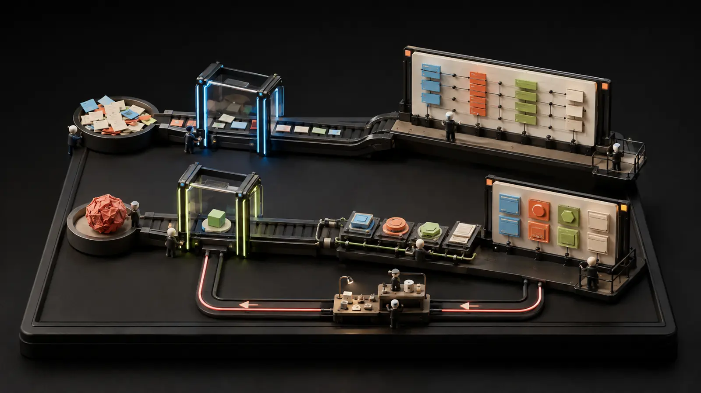

# AI Workflow Lab

Turn meeting notes or one rough idea into useful, structured output.

**[Open the live build →](https://ai-workflow-lab.recruiting-gains.workers.dev/)**

*Two workflow lanes show rough material becoming an action plan or a reusable content kit.*

## What it does

- **Meeting → Action Plan** turns pasted notes into a summary, decisions, owned action items, and a follow-up email.
- **Idea → Content Kit** turns one source into a LinkedIn draft, short thread, newsletter blurb, title ideas, and hashtags.

## Try it

1. Pick one of the two workflows.
2. Paste meeting notes or source material.
3. Generate a structured draft, then review it before using it.

The project is intentionally small enough to reverse engineer. It has no login, database, payment system, browser-exposed API key, or background job.

## Why these are good first workflows

Both tools have the same four-stage shape:

~~~text
Collect input → Validate it → Make one structured AI call → Render the result
~~~

Once that path makes sense, the same structure can become a study-guide maker,
resume feedback tool, lesson planner, support-email assistant, or dozens of
other small projects.

## Architecture

~~~text
Browser
  ├─ public/index.html       Landing page and forms
  ├─ public/styles.css       Responsive interface
  └─ public/app.js           Requests and safe result rendering
          │
          │ POST /api/meeting-plan or /api/repurpose
          ▼
Cloudflare Worker
  ├─ validates type and length
  ├─ keeps source text separate from system instructions
  ├─ requests a fixed JSON schema
  ├─ checks the model result before returning it
  └─ formats the follow-up email from validated fields
          │
          ▼
Workers AI
  └─ @cf/meta/llama-3.3-70b-instruct-fp8-fast
~~~

Static assets and the API deploy as one Cloudflare Worker. The native Workers AI
binding means there is no AI key in the browser or repository.

## Run it locally

Requirements: Node.js 20 or newer and a Cloudflare account authorized in
Wrangler.

~~~bash
npm install
npm run cf-typegen
npm run dev
~~~

Wrangler prints the local URL. Workers AI requests use Cloudflare's remote
development binding.

## Verify it

~~~bash
npm run check
npm run deploy:check
~~~

<code>npm run check</code> runs strict TypeScript checking and the unit tests.
The dry-run deployment verifies that Cloudflare can package the Worker and
static assets.

## Deploy it

~~~bash
npm run deploy
~~~

The app needs no manually created secrets. Workers AI usage may count against
the Cloudflare account's included allocation or paid usage.

## API

### Health check

~~~http
GET /api/health
~~~

### Meeting action plan

~~~http
POST /api/meeting-plan
Content-Type: application/json

{
  "text": "At least 40 characters of meeting notes..."
}
~~~

### Content kit

~~~http
POST /api/repurpose
Content-Type: application/json

{
  "text": "At least 40 characters of source material...",
  "audience": "students learning about AI",
  "tone": "friendly",
  "callToAction": "Tell me what you would build next"
}
~~~

Supported tones are <code>clear</code>, <code>friendly</code>,
<code>professional</code>, and <code>playful</code>. Source text is limited to
12,000 characters.

## Safety and privacy decisions

- Inputs are sent to Workers AI for the requested transformation and are not
  written to a project database.
- The interface never inserts AI output as HTML; it renders it as text.
- Requests must use the exact JSON media type. Foreign browser origins are
  rejected, and a streaming reader cancels request bodies above 30,000 bytes.
- Both workflows share a configured allowance of five requests per minute per
  client IP at each Cloudflare location. Only a hash enters the limiter; if
  that binding is missing or unavailable, inference fails closed. Shared
  networks can share an allowance. This is abuse throttling, not login or a
  guaranteed account-wide spending cap; review Cloudflare usage before
  inviting a large audience.
- The model is told to treat pasted material as source, not as instructions.
- A JSON schema defines every output field, and the Worker validates the result.
- Responses disable caching and include defensive browser headers.
- Application logs contain workflow names, timing, status, and request IDs;
  provider error messages and model-controlled property names are not logged
  because they can echo input. Normal
  hosting request metadata remains subject to Cloudflare's logging settings.
- <code>.env</code>, <code>.dev.vars</code>, <code>.wrangler</code>, and common
  generated files are ignored.

AI output can still be wrong. Every result is labeled as a draft for human
review.

## A practical reverse-engineering exercise

Start with <code>src/index.ts</code> and follow one route:

1. Find <code>/api/meeting-plan</code>.
2. See how <code>parseMeetingInput</code> rejects bad input.
3. Read <code>buildMeetingMessages</code> to understand the two prompt roles.
4. Open <code>MEETING_SCHEMA</code> and compare its fields with the result cards.
5. Find <code>renderMeeting</code> in <code>public/app.js</code> and trace where
   each field appears.
6. Change one output field in the schema, type, prompt, and interface.
7. Run <code>npm run check</code>, then deploy.

That exercise touches the frontend, backend, AI contract, and tests without
requiring a large framework.

## Conceptual inspiration

Research for the workflow concepts included:

- [AI277487/meeting_notes_summariser](https://github.com/AI277487/meeting_notes_summariser),
  an MIT-licensed transcript-to-structured-notes automation.
- [Jamilof1/content-repurposing-flow](https://github.com/Jamilof1/content-repurposing-flow),
  an MIT-licensed one-source-to-many-formats workflow.

This project is an independent implementation written from scratch for
Cloudflare Workers and Workers AI. No source code, prompts, credentials,
service configuration, interface, or branding were copied from those projects.

## Project status

This is a learning-focused portfolio demo, not a production publishing system.
It is an independent project and is not affiliated with Cloudflare, GitHub,
OpenAI, Meta, or the projects listed above.

The repository's root [MIT License](../LICENSE) applies to this project.
