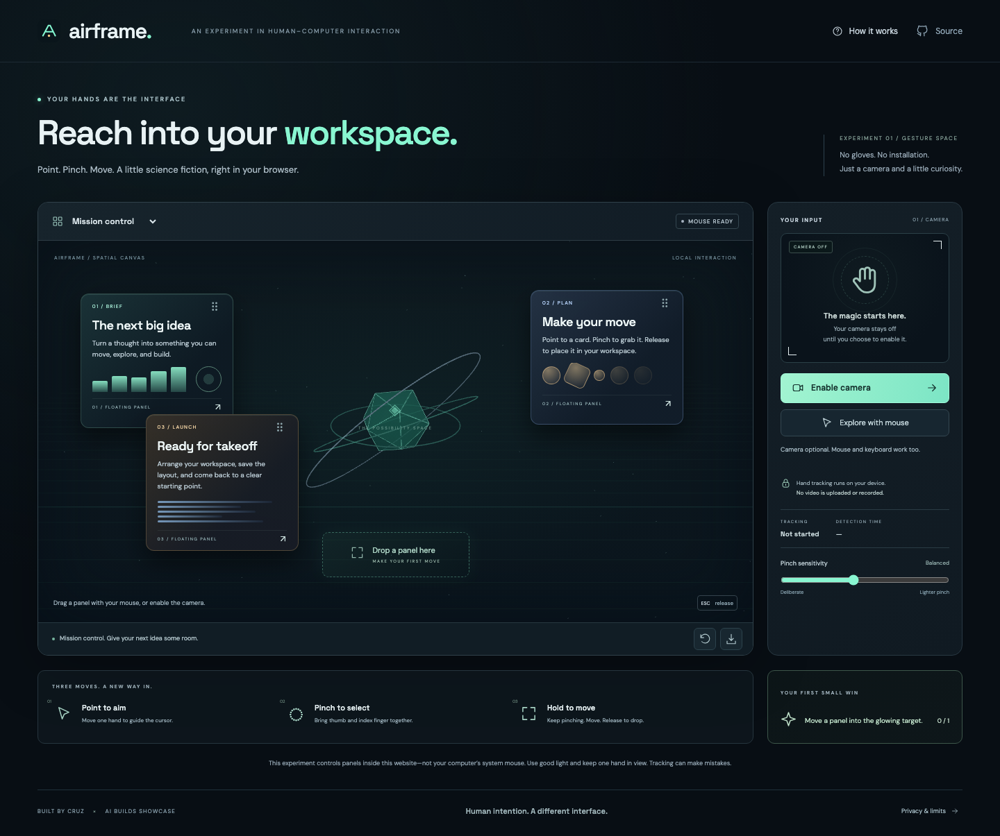

# Airframe

**Point. Pinch. Move. A little science fiction, right in your browser.**

[Open Airframe ↗](https://airframe.recruiting-gains.workers.dev/) · [Verification and limits](docs/RELEASE-VERIFICATION.md)



Airframe is an original touchless workspace experiment by Cruz. Use a webcam to move floating panels with your hand, or explore the same workspace with a mouse, touch, or keyboard. A dimensional, mint-lit scene gives the experience a science-fiction feel without special gloves or a headset.

**Important boundary:** Airframe controls panels inside this website. It does not move your operating system's mouse, click other applications, or grant remote control of your computer. Reproducing system-wide control would require a separate, explicitly installed native application and additional operating-system permissions. This project does not include that software.

## Try it

1. Open the deployed site in a modern browser. A desktop/laptop and a webcam are the easiest starting point.
2. Choose **Explore with mouse** for a camera-free introduction, or choose **Enable camera** and approve the browser's camera request.
3. Keep one hand visible in even lighting. Move your index finger to aim, pinch thumb and index finger together over a panel to grab it, and open your fingers to release it.
4. Move a panel into the glowing practice target. Try **Mission control**, **Creative studio**, or **Focus desk**.
5. **Save layout** validates only panel IDs and positions through the backend, then saves that layout in this browser. It is not an account, cloud backup, or cross-device sync.

Mouse exploration is manual interaction, not simulated evidence of camera tracking. Camera tracking activates only after permission and successful local model initialization. Detection time is local processing time, not a claim about end-to-end latency or accuracy.

## Camera, accessibility, and limits

- Camera access needs HTTPS on a deployed site, or localhost for development. Open the site directly; camera access is not enabled for embedded third-party frames.
- Browser and device support varies. A camera may be unavailable, blocked by browser settings, or busy in another application. Mouse, touch, and keyboard remain available when tracking cannot start.
- Use one visible hand, steady lighting, and a camera with a clear view. Occlusion, fast movement, low light, and unusual angles can interrupt tracking. This is an experiment, not a safety-critical or certified assistive input device.
- Pinch sensitivity is adjustable. Stop and rest your arms when needed; gesture input should never be a requirement for basic use.
- **Stop camera**, Escape, switching away from the page, and closing the page stop the stream. Escape also releases a grabbed panel.
- Keyboard: Tab to a panel's handle; arrow keys move it; Shift plus an arrow makes a larger move; Enter or Space selects it. Buttons and workspace selection are keyboard accessible.
- Reduced-motion preferences reduce decorative animation. A non-WebGL fallback preserves the usable panel interface when 3D rendering is unavailable.

## Privacy by design

Hand detection runs locally in the browser with Google MediaPipe. Video frames and hand landmarks never go to this project's backend. The app does not record video, request microphone permission, or use cloud AI inference.

The website and its pinned model/runtime files are downloaded from the same origin. The build process obtains the model from Google's official hosting and verifies the pinned byte length and SHA-256 before publishing it with the site. After loading, no third-party vision service receives your frames.

The backend receives normal web requests and, when you save, a small JSON object containing the workspace preset and panel positions. It validates that object and returns it without storing it. The application sets no tracking cookies and includes no analytics script. Cloudflare still handles ordinary hosting traffic and sampled operational request metadata; this is not a promise that the hosting provider has zero logs. Query strings are redacted from configured Worker logs, and the Worker never logs request bodies.

The saved layout lives in localStorage under `airframe.layout.v1`. Clearing this site's browser data removes it. No camera images, video, or hand-landmark history are saved there.

## What is included

| Layer | Implementation |
| --- | --- |
| Frontend | TypeScript and Vite, dimensional Three.js scene, accessible HTML panels and controls |
| Local vision | MediaPipe hand landmarks in a browser worker; deliberate pinch/release interaction and tracking-loss handling |
| Backend | Cloudflare Worker with preset, health, and bounded layout-validation endpoints |
| Infrastructure | Static assets and API on one Cloudflare Worker; configuration in `wrangler.jsonc`; no database, secret, or paid AI API key required |
| Checks | Gesture and backend unit tests, browser checks, separate browser/Worker type checks, production build, deployment dry run, real local Worker HTTP smoke test |

The backend is deliberately small because camera processing belongs on the device. It is not an unused database or a proxy for video uploads.

## Run locally

Use Node.js 24, matching the project's GitHub Actions checks.

```sh
npm ci
npm run build
npm run cf:typegen
npm run dev:worker
```

Open `http://localhost:8791`. This runs the real Worker and built frontend together, with local camera processing and the same security headers used in deployment. Building downloads the pinned model the first time, so it requires an internet connection. No camera permission is needed to build or run tests.

For frontend development, run the Worker above and `npm run dev` in a second terminal. Use the address printed by Vite. Rebuild when you need to refresh the assets served by the Worker.

## Verify

```sh
npm run check
```

This generates binding types, checks browser and Worker TypeScript separately, runs unit tests, builds the site, and performs a Cloudflare deployment dry run. It does not publish the site. A dry run alone does not prove the Worker can start; also run the actual-runtime check:

```sh
npx tsx scripts/runtime-smoke.ts
```

This starts a separate local Wrangler/workerd instance on port 8797, checks real HTTP responses, then stops only the process it started. It refuses an occupied port rather than accidentally testing another server. Override the port if needed with `AIRFRAME_SMOKE_PORT=8807 npx tsx scripts/runtime-smoke.ts`.

The path-scoped [Airframe GitHub Actions workflow](../.github/workflows/airframe.yml) runs the locked install, `npm run check`, and this actual-runtime smoke check on Node.js 24. It has read-only repository access, no deployment secrets, and no automatic deployment. A configured workflow is not evidence of a successful GitHub run; inspect its result after pushing.

For browser checks, first install the test browser, then keep `npm run dev:worker` running in another terminal:

```sh
npx playwright install chromium
npm run test:browser
AIRFRAME_VISION_TEST_URL=http://127.0.0.1:8791 npx tsx scripts/vision-smoke.ts
```

On Linux, Playwright may require its documented system dependencies (`npx playwright install --with-deps chromium`). The UI runner defaults to port 8791; set `AIRFRAME_BASE_URL` to test a different server. It checks mouse/keyboard/touch behavior, layout persistence and damaged-data recovery, permission denial/setup cancellation, responsive layout, reduced motion, and accessibility. It deliberately denies camera permission and never opens a physical camera. The vision smoke script runs real model inference on one public hand photograph and checks GPU-to-CPU fallback; it is local-server-only and does not measure live webcam accuracy. These browser/model checks are separate from the basic HTTP-only CI smoke test.

Backend tests cover byte-limited streaming input (including missing or misleading Content-Length), malformed UTF-8/JSON, card identity and coordinate validation, correct HTTP methods, API 404 handling, and security headers. Automated synthetic gesture inputs check logic; they do not establish real-world tracking accuracy. A physical webcam acceptance check is still necessary on the devices you plan to demonstrate.

## Backend contract

| Endpoint | Method | Result |
| --- | --- | --- |
| `/api/health` | GET / HEAD | Service health and local-processing/storage declarations; not cached |
| `/api/presets` | GET / HEAD | `{ "presets": [...] }`; three fictional workspace presets; cached for five minutes |
| `/api/layout/validate` | POST | Validates the object below; returns `{ "valid": true, "layout": ... }`; no persistence |

Example request to `/api/layout/validate` with `Content-Type: application/json`:

```json
{
  "version": 1,
  "presetId": "mission-control",
  "cards": [
    { "id": "mission-brief", "x": 0.06, "y": 0.12 },
    { "id": "mission-plan", "x": 0.89, "y": 0.1 },
    { "id": "mission-launch", "x": 0.18, "y": 0.82 }
  ]
}
```

Only those fields are accepted. Include all three cards from the selected preset exactly once. Coordinates must be finite numbers between 0 and 1; the response rounds to four decimal places. They describe available panel travel after accounting for panel dimensions and workspace padding, not raw screen coordinates. The body limit is 8,192 actual UTF-8 bytes, including when Content-Length is absent. Invalid input returns 400, oversized input returns 413, unsupported methods return 405 with Allow, and unknown API paths return a JSON 404 rather than the website. Errors use `{ "error": { "code": "...", "message": "..." } }`.

## Deploy and adapt

See [the Cloudflare deployment guide](docs/DEPLOYMENT.md). Deploy to your own Cloudflare account to get a `workers.dev` link; buying a domain is optional. Hosting is subject to your account's current plan and limits. No cloud inference fees are required by this implementation, but hosting is not guaranteed to be cost-free.

After deploying the current local build, `npx tsx scripts/public-smoke.ts` checks this showcase deployment's HTTPS routes, validation responses, model digest, and published assets. Set `AIRFRAME_PUBLIC_URL` when checking your own deployment. This check never opens a camera.

To change the sample workspaces, edit `src/shared/workspaces.ts`. Keep the contract and tests aligned. To change gesture thresholds, inspect the tracking module and run its tests before trying a physical webcam again.

## Attribution

The interaction idea is inspired by science-fiction gesture interfaces and the reference screenshot supplied for this project. The implementation, layout, artwork, and name are original; no video author's source code, branding, or likeness is copied. The screenshot alone does not prove how the original demonstration achieved system-wide control.

Hand tracking uses [Google MediaPipe Hand Landmarker](https://ai.google.dev/edge/mediapipe/solutions/vision/hand_landmarker/web_js). See the [third-party notices](public/THIRD-PARTY-NOTICES.txt) for package and model attribution. Deployment follows [Cloudflare Worker-first static asset routing](https://developers.cloudflare.com/workers/static-assets/routing/worker-script/) and [Workers best practices](https://developers.cloudflare.com/workers/best-practices/workers-best-practices/).
