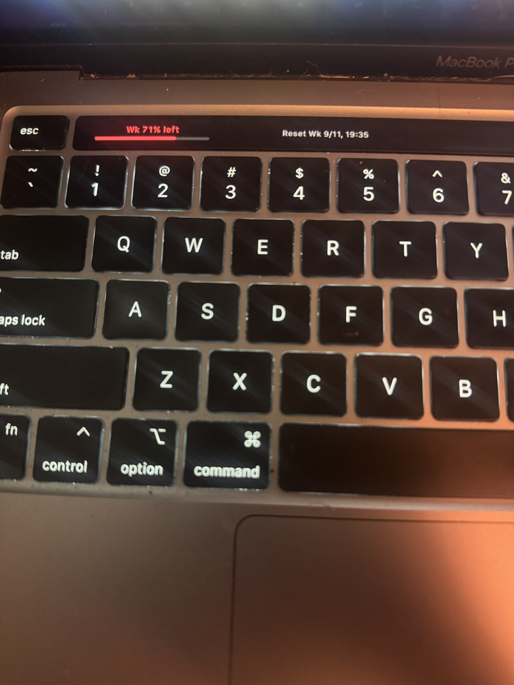

# Codex Usage Bar Red

**Your remaining Codex allowance, right above your keyboard.**

A small native Mac utility that puts a red allowance bar, percentage remaining, and reset time on your Touch Bar. A matching menu-bar indicator gives you quick access to the details and a Refresh button.



*Real hardware, photographed by Cruz Garza. The percentage in the photo is a moment in time—not a sample value the app always displays. Location and camera metadata were removed from the published copy.*

[Download the Mac app](https://github.com/recruiting-gains/ai-builds-showcase/releases/tag/codex-usage-bar-red-v2.1.1) · [What was tested](docs/VERIFICATION.md) · [Privacy](docs/PRIVACY.md) · [Original project & credits](docs/ATTRIBUTION.md)

## What it does

- **Red bars and clear labels.** Percentages mean how much allowance is **left**, not how much has been used.
- **Your actual allowance windows.** If your account reports only a weekly allowance, you get one weekly bar. A five-hour bar appears only when that window is reported.
- **Automatic refresh.** Checks every five minutes while the app is running and the Mac is awake. You can refresh manually from the menu.
- **Reset times.** Uses the service's reported reset time; it never invents a reset or a new allowance.
- **Honest warnings.** Low allowance has a text warning. Failed updates, expired windows, or readings older than 11 minutes are marked **STALE** instead of looking current.
- **No camera, no AI prompts.** This is an allowance monitor, not an AI agent or gesture controller.

## Requirements

| Item | What you need |
| --- | --- |
| Download | Apple Silicon Mac (`arm64`); this release is **not** an Intel/universal binary |
| macOS | 14 or newer; hardware-tested on macOS 26.6.2 |
| Touch Bar | A Mac with a physical Touch Bar for the keyboard display; the menu-bar indicator works separately |
| Account | An installed, signed-in ChatGPT/Codex client with a compatible local `codex` executable and reported allowance data |
| Connection | Internet access for the existing Codex client to retrieve account usage |

No BetterTouchTool purchase, extra API key, Cloudflare deployment, or domain is needed. This runs on your Mac, not in a browser. Intel source builds are possible through the build script, but have not been validated for this edition.

## Install and use

1. Open the [release page](https://github.com/recruiting-gains/ai-builds-showcase/releases/tag/codex-usage-bar-red-v2.1.1) and download **Codex-Usage-Bar-Red-v2.1.1-arm64.zip**.
2. Unzip it, move **Codex Usage Bar Red.app** into your Applications folder, and open it.
3. Click back into **ChatGPT/Codex**. By default, the red Touch Bar display appears while that app is active; switching away restores other apps' controls.
4. Click the menu-bar percentage for details, Refresh, Settings, or Quit. Launch at login is off unless you enable it yourself.

**Security notice:** this experimental build is locally ad-hoc signed, not Developer ID signed or Apple-notarized. macOS may block it as an unidentified application. Do not disable Gatekeeper or remove quarantine flags to bypass the warning. Review the source, checksum, and [Apple's guidance on opening apps safely](https://support.apple.com/en-us/102445) before deciding whether to allow this specific app. Do not override a malware warning. Building from reviewed source is also an option.

The release includes `SHA256SUMS.txt`. If you use Terminal, you can check the download from the folder containing both files:

```sh
shasum -a 256 -c SHA256SUMS.txt
```

## What changed from the original

This is a credited adaptation of [yizhigou/codex-usage-bar](https://github.com/yizhigou/codex-usage-bar), not a claim to have invented the original utility.

The red edition adds the red theme, real-duration allowance labels, dynamic one/two-window display, stale-reading warnings, low-allowance text, 39 deterministic model/parser checks, and a bounded usage connection with the documented initialization handshake. The app has a separate identity so it does not replace the original utility's settings.

The original [MIT license](LICENSE) and [unofficial-project notice](NOTICE.md) are retained. See [attribution](docs/ATTRIBUTION.md) for the upstream revision and full scope of the adaptation.

## How it works

The native Swift/AppKit interface requests allowance data through the locally installed Codex app server. The only account request made by this utility is `account/rateLimits/read`. The existing Codex client handles authentication and contacting OpenAI; the utility does not read credential files or chat history directly.

Returned window durations determine the labels. `usedPercent` is converted to a clamped remaining percentage, and reset times come from the server. The connection has a 15-second read deadline and a 1 MiB response limit. No prompts, conversations, quota-reset redemptions, or billing changes are sent.

## Build and test

Install Apple's Swift command-line tools, clone this showcase, and enter this project folder:

```sh
git clone https://github.com/recruiting-gains/ai-builds-showcase.git
cd ai-builds-showcase/codex-usage-bar-red
bash scripts/test-local.sh
CODEX_USAGE_ARCHS=arm64 ./build-app.sh dist-red
```

The build has no third-party library dependencies and refuses to overwrite an existing output app. Choose a new output directory if you rebuild. The deterministic tests do not sign in or access an account.

An optional **live** read-only check uses your existing signed-in account:

```sh
"dist-red/Codex Usage Bar Red.app/Contents/MacOS/CodexUsageBar" --self-test
```

GitHub Actions also runs the fixture tests, compiles an ARM64 app, and verifies its bundle signature. It does not run the live account check or test a physical Touch Bar.

## Limits and troubleshooting

- **No five-hour bar?** Your account may report a weekly allowance only. An absent allowance is not zero usage.
- **STALE?** Refresh and check your connection/sign-in. The displayed amount is the last known reading, not a fresh allowance.
- **Nothing on the Touch Bar?** Make ChatGPT/Codex the active app, then check the utility's Settings. Macs without a physical Touch Bar cannot show the keyboard display.
- **Local client not found?** The utility checks `/Applications/ChatGPT.app`, `/Applications/Codex.app`, and common Homebrew/CLI locations. A differently installed client may require a source adjustment.
- **Future macOS compatibility:** automatic Touch Bar presentation uses guarded private macOS APIs inherited from upstream. An OS update can break that presentation even if allowance retrieval still works. This is not a Mac App Store build.

To stop, choose **Quit** from the utility's menu. To uninstall, disable its optional launch-at-login setting if you enabled it, quit, and move only **Codex Usage Bar Red.app** to Trash. No changes to ChatGPT or Airframe are needed.
