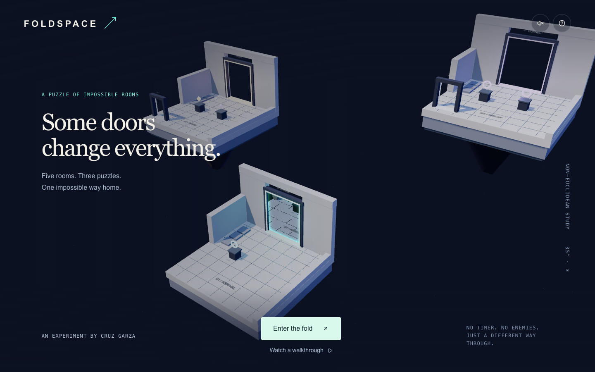

# Foldspace

**Five floating rooms. Three rules. One impossible way home.**

Foldspace is a short 3D portal-routing puzzle by **Cruz Garza**. Turn a doorway to change its destination, carry the key that matches a locked door, and connect both ends of a portal pair. Then walk onto the light in Home.

The windows in the active door render the actual destination room. The rooms are separate platforms with explicit portal transitions; this is a playful spatial illusion, not a simulation of wormhole physics.



[Download the Instagram demo](media/Foldspace-Instagram.mp4) · [Recording notes and caption](docs/DEMO.md)

## Play

**[Play Foldspace](https://foldspace-by-cruz.cg-stackd.chatgpt.site/)** — public browser game. No sign-in is required. Publication and validation notes are in `docs/VERIFICATION.md`.

- **Move:** WASD, arrow keys, or hold the on-screen direction buttons.
- **Interact:** move near a plinth, then press E or tap its action button.
- **Travel:** walk through an open door. Clicking a preview does not move the player.
- **Recover:** white arches take you back. Falling returns you to the room's entrance.
- **Pause:** Escape or the pause button. Resume, return to the room entrance, or explicitly reset the game.

Progress saves in this browser. No account, database, external AI call, or paid API key is required to play. If local storage is unavailable, the game still runs for the current session.

## The three rules

| Rule    | What changes                                                                           | When it counts                                     |
| ------- | -------------------------------------------------------------------------------------- | -------------------------------------------------- |
| Choose  | The cyan door leads to Arrival or Prism.                                               | Walk through to Prism.                             |
| Carry   | Amber and violet plinths replace the key in your hand.                                 | Carry the amber diamond through the matching door. |
| Connect | One console changes Relay's destination; the other changes Reach's return destination. | Set Relay → Reach and Reach → Relay, then cross.   |

The final room has a real goal pad. Turning controls alone never awards a solved puzzle. Wrong choices remain recoverable.

## Run locally

Use Node.js **22.18+** or **24+** (the tests use native TypeScript stripping).

```sh
npm ci
npm run dev
```

Open the local URL printed by the server. Then:

```sh
npm test
npm run typecheck
npm run build
```

The build emits a Cloudflare Worker in `dist/server/index.js` and browser assets in `dist/client/`. The included Vite configuration preserves the Sites packaging plugin and Cloudflare's React server environment. No D1 or R2 resources are needed: the only persistence is a browser-local checkpoint.

For a new hosted copy, register your own Site and replace `project_id` in `.openai/hosting.json`. Do not deploy a fork against the original owner's Site. Hosting access and deployment credentials are managed outside this repository.

## How it works

- `lib/game.ts` owns the deterministic state machine, physical floor bounds, proximity, collisions, portal crossing guards, save validation, and replay validation.
- `lib/world.ts` draws the scene with Three.js, transforms the preview camera to the destination, and drives the same movement rules for normal play and the automatic walkthrough.
- `app/page.tsx` provides the React controls, keyboard/touch input, pause flow, progress, local saves, and accessible text equivalents for colors.
- `app/api/rooms/route.ts` serves the room catalog.
- `app/api/verify/route.ts` checks a bounded sequence of puzzle actions on the server. This checks logical legality; **it does not authenticate player movement, identity, or completion time** and is not an anti-cheat system.

Portal previews are one rendering level deep. Recursive portal rendering, first-person traversal, jumping, enemies, and user-authored levels are outside this version.

## Instagram demo

`/?demo=1` runs the automatic walkthrough. `/?demo=1&reel=1` uses the vertical presentation. It uses the same real movement, proximity checks, collision rules, portal transitions, and goal predicate as the playable game. It does not overwrite a player's saved progress.

The 30-second export is a deterministic recording of that walkthrough, with readable pacing and original synthesized audio. Its build credit describes the development tools; no model runs inside the game. See `docs/DEMO.md` for the recording method and caption.

## Development credit

Created by Cruz Garza. **Built with GPT-6 Astra in Codex, using Ultra reasoning.** Development included separate puzzle-design and independent logic reviews.

The game mechanics, scene construction, and rendering integration are original to this project. React, Three.js, vinext, the Sites starter, and shadcn/Radix components provide the underlying libraries and framework. Their licenses and notices remain applicable. This is an independent project, not affiliated with OpenAI, GitHub, or Cloudflare.

See `docs/VERIFICATION.md` for checks and limits.
