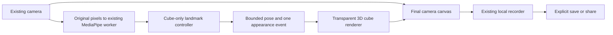

# Cube mode

Cube adds one solid blue 3D object with white wireframe to GhostFrame. It moves through the midpoint of two hands, grows with their separation, and changes between blue and violet/cyan appearances after a brief pinch and release. It is a local camera effect inspired by a gesture-graphics reference, not an exact reconstruction of that reference's software or a measured 3D scan.

## Use it

1. Open GhostFrame and choose **Cube**. The labelled simulated preview works without a camera.
2. Select the front or back camera and tap **Start your camera**. Keep both hands fully visible, initially open.
3. Move both hands to position the cube. Spread them apart to enlarge it. Pinch one thumb and index finger briefly, then open again to change the appearance once. Open both hands after tracking loss before trying again.
4. For manual control, select **Move it myself**. Drag, use the position/size sliders, or focus the camera canvas and use arrow keys. **Appearance** changes the look directly.
5. Tap **Record**, then **Stop recording**. Replay the clip and explicitly choose **Save video** or **Download**. The existing one-minute/48 MiB limit and silent recording apply. Keep the page open until saved.

The normal Cube view and fitted fullscreen preserve the selected camera's proportions. **Fill view** can crop the sides. Changing orientation or leaving Cube for a differently sized view finishes an active clip before the recording canvas changes dimensions. A normal stop releases Cube graphics; start the camera or tap **Reset effect** to resume the preview. No clip survives a page refresh unless it has been saved.

## Small implementation, existing services

The frontend lazily loads Three.js only when Cube is selected. It owns one orthographic scene, box geometry, white edge lines, shader fill and transparent WebGL2 context. Rendering is capped at 768 pixels on the longest edge with pixel ratio 1. The renderer copies into the final Canvas2D scene synchronously in the same paint; there is no separate visible overlay for recording to miss. Reduced-motion preference freezes the decorative animation.

The camera, worker, MediaPipe model, backend, Cloudflare Worker name, Workers AI binding and quota store are reused. Cube requests hand landmarks without person segmentation. No second camera, vision worker or cloud inference is created. Camera frames, local photos and recordings remain in the tab. **Send still to AI** remains an explicit separate HandFrame action; Cube cannot invoke it.

## Gesture and lifecycle contract

- Cube takes raw image landmarks, applying the selected camera mirror exactly once. Palm-center midpoint controls position. Separation is `hypot(aspect × dx, dy) / min(1, aspect)`, scaled by 0.75 and clamped to 0.15–0.65 of the shorter canvas dimension. This is image-plane control, not physical distance.
- Position and scale use time-based smoothing with a 45 ms constant. No pose predicts future hand motion.
- Thumb/index distance is normalized by wrist-to-middle-knuckle length, accounting for image aspect. Open ratio is at least 0.55; close ratio is at most 0.30. Both hands must open to arm. One hand pinches for at least 120 ms and releases for one appearance event. A long hold never prepares a still or repeats a change. Overlapping pinches cancel the gesture and require both hands open again.
- Missing/invalid landmarks, ambiguous handedness, crossing/order reversal, large jumps, reversed/repeated timestamps, camera/aspect changes and mode/manual transitions cancel pending gestures. MediaPipe's handedness score is not treated as positional accuracy.
- The last valid visual pose lasts at most 150 ms; the paint loop also checks expiry when inference stalls. Held poses never become gesture samples. Reacquisition requires open hands to re-arm. Camera-session stale-result protection remains in the existing pipeline, and Cube ignores results captured before its latest input boundary.
- Mode exit, stop, pagehide and hidden-camera release dispose owned geometry, materials, context and listeners. A renderer import finishing after disposal cannot create an obsolete graphics context. Camera-only view resets Cube gestures.
- Tracking-loss and graphics-error cues remain visible in fullscreen. Graphics failure leaves other modes available. One deliberate **Retry cube graphics once** action is allowed per page session. A second failure leaves Cube unavailable; no render-loop restart storm runs.

## Verification and boundaries

Focused controller fixtures verify ten gestures produce ten events in each front/rear × portrait/landscape combination, plus smoothing/clamps, hold, loss, stalls, hysteresis, timestamp changes, identity ambiguity, crossing and reset behavior. The full unit suite and existing harness still cover other effects, camera lifecycle and the explicit still backend.

`npm run test:cube` starts a bounded local production preview. The browser suite uses generated camera pixels and injected landmarks while exercising actual WebGL, Canvas2D, MediaRecorder, file download and replay of the downloaded bytes. It checks blue fill, white edges, retained camera pixels and changing frames, along with integrated gestures, four coordinate cases, no media uploads, mode isolation and cleanup. Reports and synthetic clips are ignored under `test-results/`. See [independent review](CUBE-REVIEW.md) for the observed results and [recording](RECORDING.md) for existing save behavior.

Physical iPhone acceptance is **pending**. It requires observed front/back and portrait/landscape sessions, ten real pinch/release attempts, tracking loss and mode transitions, a 60-second Cube run compared with HandFrame on the same phone, and actual native saving/replay. Measure achieved cadence, stalls and heat; 30 fps is a target, not a verified phone claim. Desktop WebKit and Chromium fixtures do not establish iPhone performance, real tracking accuracy or Photos/share-sheet behavior.
