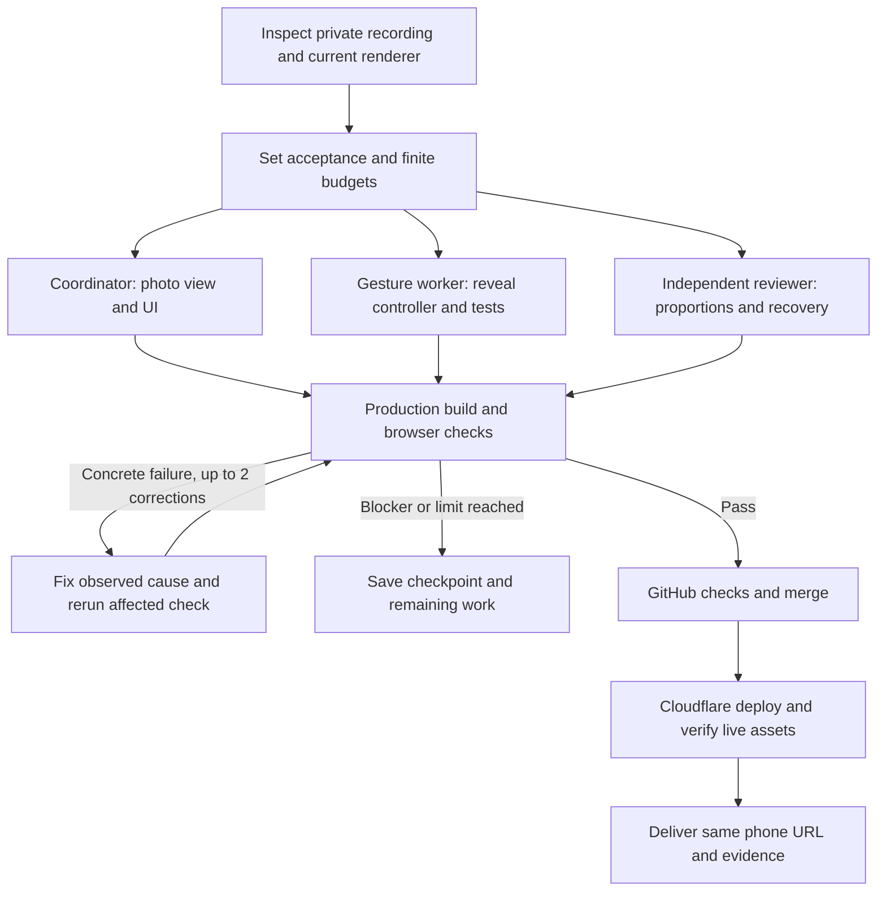

# Clear pictures and optional one-hand reveal

A tall screenshot used to map directly to the shallow opening between four fingertips. Spreading the hands made it wider without providing enough height, so the picture became a squeezed strip. Cinema decoration also covered its top and bottom. This was a presentation problem in the supplied recording, not evidence that Instagram screenshots failed to decode.

**Open to full view** is now the default for local photos. Opening both hands expands the complete picture into the camera canvas while preserving its original width-to-height ratio. It does not depend on the four tips forming a perfect quadrilateral. Cinema bars are excluded from local pictures. **Fit between hands** and **Stretch with hands** remain available for shaping and perspective; the latter intentionally changes proportions.

For **Back · world**, **One-hand full picture** is optional. An open palm reveals the whole image, a closing hand reduces it, and a closed or lost hand hides it. Show an open palm again after tracking loss. **Next picture** changes the selected photo in this mode. The two-hand close/reopen cycle remains available with that option off. Camera permission still begins with Start your camera.

The picture is drawn into the recording canvas. Fullscreen and Record use that same image; no CSS-only photo layer disappears from the saved video. Portrait pictures fit the available height with the camera visible at the sides. This does not enlarge the lens's field of view or remove borders captured inside the screenshot itself.

## Build graph and ownership

The coordinator owns integration, rendering, documentation and publication. The gesture worker owns only the new reveal controller and its tests. The independent reviewer reads source and writes separate test evidence. Private video inspection stays local. Each file has one writer; browser tests use isolated sessions and generated media.

This is a bounded build process using host collaboration plus the existing executable check harness. It adds no permanent agent service to the website. The coordinator's limits are 18 stages, 90 minutes and two correction passes per stage, checked at stage boundaries. The repository harness separately enforces command deadlines, step/attempt bounds, exclusive execution and saved source fingerprints. See [repeatable checks and recovery examples](PHONE-STUDIO.md#repeatable-checks).

## Acceptance evidence

See the current entry in [Verification](VERIFICATION.md) for executed checks and limits. Tests distinguish source aspect, visible edges and meaningful image content from merely seeing a nonempty rectangle. Generated hand inputs exercise open/closed states, tracking loss and reacquisition, camera/mode changes, optional one-hand gating, two-photo cycling and recorded-frame output. Physical phone gesture accuracy still needs a trial on the device.
