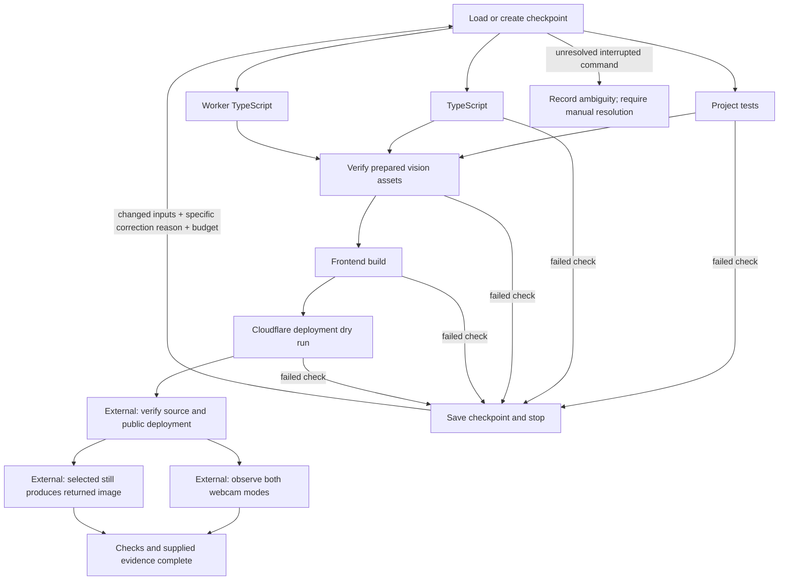

# GhostFrame engineering workflow

The project has an executable command-check harness in `harness/`, alongside the coordinator, feature engineer and independent reviewer collaboration used to develop it. The harness runs checks; it does not create AI agents, impersonate a reviewer, open a camera, call an image provider or publish a deployment.

## Workflow graph



Tests and TypeScript may run concurrently, with at most two subprocesses in flight. Dependent nodes start only after their prerequisites pass. A discovered failure stops new dispatch; any already-started independent check settles within its own timeout. Each check runs without a shell, and test filenames are expanded by Node instead of relying on shell glob behavior.

The roles retain the ownership assignments in `OWNERSHIP.md`. Host-supported subagent execution and the independent review report are separate evidence. A stage named “review” would not prove an independent reviewer existed.

## Start and resume

Install dependencies and prepare the approved model assets before the first project run:

```sh
npm ci
npm run assets
npm run test:harness
npm run harness -- --new
```

The asset stage invokes the same preparation/verification script. It may fetch a missing approved model; ordinary repeat runs use the existing assets. The fingerprint includes the actual `public/` bytes, including models, WASM and the authored vision worker, as well as `scripts/`, source, tests, lockfile and configuration. An asset generation/change during an active check invalidates that run's input snapshot; finish preparation, inspect the change and resume with a correction.

Run `npm run test:harness` separately. The workflow does not recursively run itself inside its own test graph.

```sh
npm run harness -- --resume
```

An unchanged resume reuses successful command results and evidence receipts. Changing a source or runtime asset fingerprint invalidates previously successful checks and external receipts. It does not silently replay publication. Graph changes require an explicit new run; new runs receive separate directories and preserve previous history.

After correcting a failed check:

```sh
npm run harness -- --resume --retry tests --reason "Corrected the missing-hand release condition and regression fixture."
```

The retry needs a failed node, changed hashed inputs and a specific reason of 12–300 printable characters containing at least three words. Repeating identical inputs or a prior correction reason is rejected. These mechanical checks establish that a declared change occurred; a human reviewer still decides whether the reasoning is sound, and the subsequent test decides whether it worked. The checkpoint stores the reason's digest rather than its prose. If two independent checks failed, acknowledge each correction separately; neither automatically retries.

## Enforced budgets and recovery

- **30 steps per run.** A step is one command attempt or one accepted external evidence gate. Logging and checkpoint writes are not additional work steps.
- **90 minutes of active runner time per run.** Each subprocess timeout is at most the remaining run budget and ordinarily at most five minutes. A deadline prevents further dispatch and sends termination to the process group. A process ignoring graceful termination receives a kill after 250 ms. OS scheduling, termination and checkpoint cleanup can extend wall-clock shutdown slightly beyond the deadline.
- **Three attempts per command node.** Initial execution plus at most two additional executions; counts are not reset by resume or by changing source. Tightened budgets persist. Starting a genuinely new run is explicit.
- **One writer per checkpoint.** An exclusive PID lock rejects a concurrent runner. A lock with a confirmed dead process is preserved as stale evidence before recovery. Ambiguous or unreadable lock ownership is not bypassed.
- **Atomic checkpoints before command launch and after completion.** An append-only JSONL event log records node, attempt, status, timing and safe result codes. Standard output/error, camera frames, prompts, credentials and raw evidence are not copied into these records. Run a failed command directly if its ordinary diagnostic output is needed.
- **Interrupted command means uncertain result.** A running node without a completion receipt becomes `ambiguous` after restart. It is never automatically repeated, even if its command might have completed before the interruption. SIGINT/SIGTERM are handled and recorded. After an abrupt process kill, the exact unrecorded active time is unknowable; recovery conservatively charges the elapsed gap up to the recorded command timeout, which may include downtime. The harness cannot promise OS enforcement after its own process or machine is forcibly terminated.

Only an explicitly idempotent check may be manually acknowledged for another attempt:

```sh
npm run harness -- --resume --ack-interrupted typecheck --reason "Confirmed the interrupted command only checked source and can be repeated."
```

The attempt limit still applies. A non-idempotent stage cannot use this escape hatch or the ordinary retry command; its external state needs inspection. The project's graph contains no publication command, so publication is never an automatic recovery side effect.

## External evidence gates

Passing automated checks ends at `awaiting-evidence`, not at a claim that the camera effects or live deployment work. The coordinator must separately observe the required result, retain appropriate evidence, and supply a small JSON receipt for each gate.

Example shape, using the **actual** fingerprint printed by that run:

```json
{
  "gate": "publication",
  "status": "passed",
  "sourceFingerprint": "COPY_THE_RUN_SOURCE_FINGERPRINT",
  "observedAt": "2026-09-10T00:00:00.000Z",
  "checks": {
    "github-source-verified": true,
    "cloudflare-url-verified": true,
    "assets-loaded": true
  },
  "references": ["REPLACE_WITH_ACTUAL_COMMIT_AND_DEPLOYMENT_EVIDENCE"]
}
```

This example is not evidence and should not be submitted unchanged. Keep actual receipts under `.harness/evidence/`; do not include raw camera images or credentials. The CLI accepts repeated flags:

```sh
npm run harness -- --resume --evidence publication=.harness/evidence/publication.json
```

The runner checks the schema, exact source fingerprint, required check names and observation timestamp; it stores a digest of the receipt. It labels the result **operator-supplied external evidence**. It does not independently prove that an asserted observation happened, that a URL is still reachable or that a camera result is accurate.

The webcam gate requires person disappearance/restoration, portal behavior, HandFrame movement, short/long pinch behavior and camera stop. The AI-still gate requires only the selected still to be submitted and a returned image displayed. A missing provider remains pending; local filters cannot satisfy that gate. The exact machine-readable checks are in `harness/graphs.mjs`.

## Working examples

The demos launch only local Node fixtures and do not use a camera, network, repository or provider:

```sh
node harness/cli.mjs --demo success --new
node harness/cli.mjs --demo failure --new
node harness/cli.mjs --demo failure --resume --repair-demo --retry check --reason "Changed the demo ready flag from false to true."
```

The middle command deliberately exits 2 with a failed `check` node. The third explicitly changes the fixture, records the correction digest and resumes the same run. It does not relabel the failed attempt as a pass. A new failure demo resets only its documented fixture input, while preserving earlier run directories.

CLI exit codes: **0** means all nodes in the selected graph are complete; **2** means blocked or invalid invocation; **3** means external evidence is pending. A demo's completion is only a fixture result.

## Files and implementation evidence

`harness/runner.mjs` exports `runGraph(options)` and `fingerprintInputs(projectDir, inputs)`. `graphs.mjs` defines the project and demo graphs. `cli.mjs` prints a compact status summary and checkpoint path.

All normal runtime files live in ignored `.harness/<graph>/`, with `current.json`, a lock and separate `runs/<run-id>/checkpoint.json` / `events.jsonl` files. Runner test fixtures stay under `.harness/runner-tests/`. The runner does not claim to sandbox subprocess access: its commands inherit the local user's existing environment and permissions. Graph commands must be reviewed project code.

The runner tests cover parallel prerequisites, unchanged resume, justified corrections, preserved caps, subprocess timeout, lock contention, uncertain side effects, external evidence gates, runtime asset fingerprints, checkpoint-before-launch and explicit cancellation. These fixtures validate the harness; they are not evidence that a real webcam, provider or deployment passed.

On September 10, 2026, the success demo completed three steps. The deliberate-failure demo stopped after two steps, then completed the same run after its explicit repair, with the failed node's attempt count increasing from one to two. No real project deployment or camera evidence was produced by those demos.
