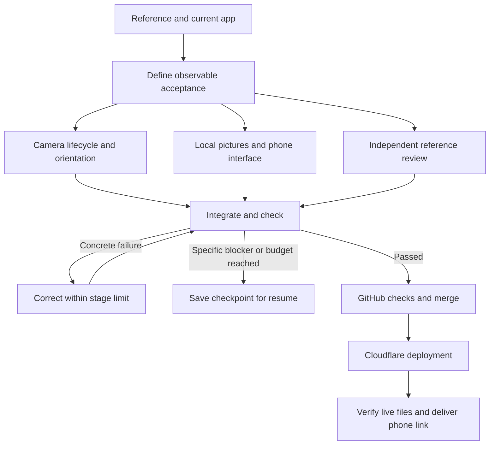

# Phone studio: cameras and pictures

HandFrame can use a local picture instead of a color effect. Add up to two pictures, open the space between your thumbs and index fingers to reveal one, and bring both palms together then reopen to switch to the other. The first opening retains the selected picture. Keeping your hands open does not repeatedly switch. The buttons also work without gestures.

## Try it on your phone

1. Open [Jedi Mindtrick](https://jedi-mindtrick.recruiting-gains.workers.dev/) in Safari or Chrome. On a phone, HandFrame is selected initially.
2. Add **picture 1** and optionally **picture 2**. The app selects **My pictures**. Pictures are held only in this tab; refresh requires adding them again. Choose pictures before starting the camera, because an operating-system picker can pause a camera tab.
3. Choose **Front · selfie** or **Back · world**, then **Start your camera**. Allow camera access. When already running, changing this choice stops the old stream and starts the selected camera. If a requested camera is unavailable, the message explains how to choose another and retry.
4. Prop the phone sideways to see both hands comfortably. Form an opening with thumbs and index fingers; one L may point downward. The whole picture maps between the four finger corners and moves with their width, height, tilt and perspective. Open corners must form a valid surface; closing or crossing them hides the photo until the opening returns.
5. Bring both palms together until the cue appears, then reopen to switch once. **Next picture** and the picture cards offer a touch alternative. **Color worlds** restores the eleven existing filters; gestures then switch colors instead of photos.
6. Use **Full screen**, then **Record**, make your movements, and stop. **Save video** opens the supported share menu; **Download** saves via the browser. Select **Save Video** if your phone offers it. The website cannot silently write to Photos.

**Stretch with hands** maps the entire picture to the opening, matching the reference's stretching effect. **Fit inside frame** adds space around the image based on the surface's average displayed proportions; perspective still follows the fingers. The surrounding camera stays visible. A bigger view does not increase the camera lens's field of view.

## Local resources and recovery

- Two slots, each limited to 15 MB input. Supported JPEG, PNG, WebP, AVIF and browser-supported HEIC/HEIF files are decoded locally. Unsupported or corrupt files retain the previous picture and show a useful message.
- Decoding has a 12-second wait limit. Images above 50 million decoded pixels are rejected; retained images are reduced to at most 1,600 pixels on their longest side. This caps retained texture size, not the browser's peak memory during its initial decoder operation.
- Replacing, clearing or superseding a pending load invalidates that load's revision. Late results are disposed instead of restoring an old photo. Clearing releases the bitmap and preview URL. Nothing is written to a server, IndexedDB or local storage by the photo feature.
- Selecting photo mode clears an optional prepared AI still, hides its submission controls and blocks still preparation. Local photos are never silently submitted to the AI endpoint.
- Camera starts retain the original user gesture. Overlapping permission requests are serialized because getUserMedia has no abort signal. Late streams are stopped. A size/rate constraint failure allows one correction; a permission failure never triggers an automatic retry. Model loading and inference retain their existing watchdogs and one-frame-in-flight limit.
- Front video is mirrored; rear video is unmirrored. Hand and person-mask coordinates use the same display direction. The app rejects a known opposite-facing feed instead of labeling it as the selected camera.
- The dashboard uses layered violet/blue surfaces and pointer-responsive photo cards. These are CSS transforms, not a WebGL scene or motion-sensor feature. Reduced motion disables the decorative movement. Hand detection does not depend on dashboard animation.

## Build workflow

The build process used three distinct responsibilities: integration and publication; camera lifecycle and its tests; independent reference and failure review. Each file had one writer. These are host-supported collaboration roles, not permanent services inside the website.



The coordinator's build budget was 20 stages, two hours and at most two corrections per stage, checked at action boundaries. The repository's executable harness independently enforces step/time/attempt limits for its commands, stores source fingerprints and resumes completed checks without repeating them. Its project graph now includes the phone browser check before deployment validation. It does not run an agent scheduler.

## Repeatable checks

```sh
npm ci
npm run assets
npm test
npm run test:harness
npm run build
npx playwright install chromium
PLAYWRIGHT_CHANNEL=chromium npm run test:phone
npm run harness -- --new
```

The phone check starts a temporary local production preview, uses generated camera streams and original synthetic hand landmarks, and closes its server afterward. It uses real browser image decoding, the real photo compositor and real canvas recording, but does not activate a physical camera or call AI. Browser reports are written to ignored `test-results/phone-studio/`.

The harness has a working success and correction example:

```sh
node harness/cli.mjs --demo success --new
node harness/cli.mjs --demo failure --new
# Expected failure above: the isolated fixture is not ready.
node harness/cli.mjs --demo failure --resume --repair-demo --retry check --reason "Corrected the isolated readiness fixture"
```

The second failure-demo command changes only its fixture and resumes the saved graph. Because that change updates the source fingerprint, checks are revalidated. An unchanged successful resume skips completed checks. Physical phone gesture recognition, camera permission behavior in each embedded browser and the phone's save-menu options still require a trial on that device. Synthetic tests do not establish physical hand-tracking latency or a guaranteed frame rate.

API references: [camera selection and stopping tracks](https://developer.mozilla.org/en-US/docs/Web/API/MediaDevices/getUserMedia), [actual facing mode settings](https://developer.mozilla.org/en-US/docs/Web/API/MediaTrackSettings/facingMode), [local bitmap decoding](https://developer.mozilla.org/en-US/docs/Web/API/Window/createImageBitmap).
