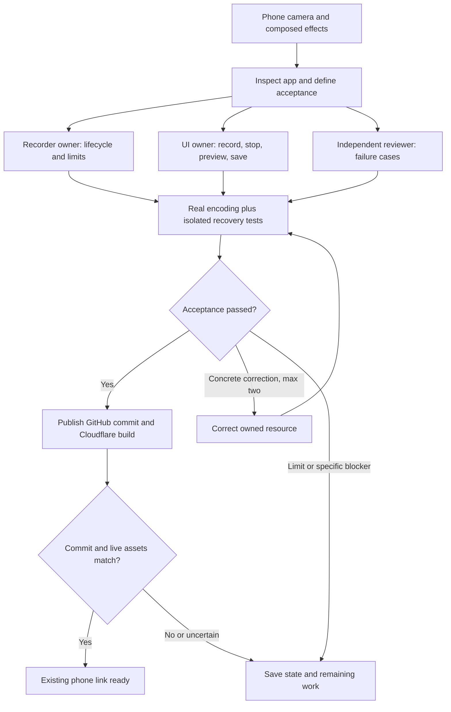

# Record a mindtrick

Tap **Record**, move your hands, then tap **Stop recording**. Preview the resulting clip and choose **Save video**. The same controls are available in the normal studio and fullscreen. Stopping the recording leaves the camera running.

On iPhone, the save button opens the native share menu when file sharing is supported. Choose **Save Video** when offered. **Download** provides a browser download to Downloads/Files. Cancelling or failing a share keeps the same clip available for another explicit attempt. The app never claims that a closed share menu proves a Photos save. A web page cannot silently add a file to the Photos library.

## What gets recorded

The already-composited camera canvas: your camera view, Invisible or HandFrame, selected color effects and any displayed still. Controls, status labels and green page borders are not recorded. Just camera records the clean camera canvas. The recording keeps the whole 768 × 432 canvas; fullscreen and Fill view change display size/cropping, not the encoded frame. No microphone audio is requested or recorded.

MP4/H.264 is preferred when the browser reports support. WebM is a fallback, with the file extension taken from the recorder’s actual output type. Browser support and device load affect frame rate. The recorder requests 30 fps; this is not a guaranteed encoded frame rate.

## Bounded lifecycle

Idle → recording → finishing → clip ready → explicit share/download or discard. One clip is retained at a time; a new recording cannot overwrite an existing clip. Save before closing or reloading the page. The clip lives in browser memory, not in a persistent gallery or server store. A browser unload prompt is a best-effort safeguard, not guaranteed mobile recovery.

Clips stop at 60 seconds. Encoded chunks are limited to 48 MiB; a clip exceeding the safety limit fails rather than offering a potentially truncated file. Finishing has a five-second timeout. Unsupported APIs, encoder errors, empty output and unavailable formats produce a recoverable message. No recording or sharing is automatically retried. Camera stop/disconnection or a hidden tab requests finalization; reopening does not automatically restart the camera. A force-closed or killed browser can lose an unsaved clip.

Only the stream created from the canvas belongs to the recorder. Its cleanup must never stop the camera pipeline’s own tracks. Blob URLs are revoked when a clip is discarded. Clips are not sent to the Worker or any AI service; the existing explicit still submission remains separate.

## Build workflow and evidence




The existing command harness runs tests and type checks in parallel, then asset verification, build and deployment dry-run. It saves source fingerprints, action results and resumable checkpoints. Recorder unit tests exercise bounded failure/recovery with isolated fakes. The browser recording script tests real encoding and playback with a generated camera stream; file-share success/cancellation is mocked because the native OS chooser requires a person. These tests do not establish physical iPhone camera performance or an actual Photos save.

```sh
npm test
npm run test:harness
npm run build
node scripts/recording-browser-check.mjs http://127.0.0.1:8798
```

The coordinated build uses separate implementation, integration and independent-review responsibilities. It does not add a permanent agent server to the app. Publication is verified against the GitHub commit and the deployed Cloudflare assets; uncertain publication actions are reconciled before retrying.

Sources: [WebKit MediaRecorder](https://webkit.org/blog/11353/mediarecorder-api/), [WebKit’s newer recording formats](https://webkit.org/blog/16574/webkit-features-in-safari-18-4/), [Web Share file handoff](https://developer.mozilla.org/en-US/docs/Web/API/Navigator/share).

## Verified September 11, 2026

- 163 application tests passed, including 17 focused recorder tests. All 14 workflow-harness tests passed.
- 54 local browser checks passed: 25 application regressions, 19 fullscreen cases, and 10 recorder cases.
- The actual Chrome encoder produced a playable 768 × 432 MP4. Two decoded frames differed at more than 124,000 pixels; the camera remained live after recording stopped, and the recorder's canvas tracks ended.
- The share mock confirmed cancellation followed by a fresh-tap retry passed the exact same File, both with active user gestures. The real download path produced a nonempty MP4. Portrait and landscape fullscreen controls stayed visible, within bounds, and reachable.
- Stopping the camera and simulated tab hiding finalized a retained clip. Unsupported recording APIs were explained without breaking camera operation. No physical iPhone Photos save is claimed.
- The six executable check-graph nodes passed on the final source: app tests, two type checks, verified assets, build and deployment dry run. The separately observed publication gate is recorded at release; physical-webcam and real-provider observations remain distinct.
