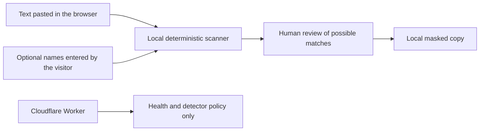

# Mask Before You Ask

> **Share the question. Keep your private details.**
>
> A browser-based privacy check before you paste text into an AI tool.

**[Open the live build →](https://mask-before-you-ask.recruiting-gains.workers.dev/)**


Mask Before You Ask finds common private details—such as email addresses, phone numbers, private links, IP addresses, payment-card-like numbers, and account references—and replaces the items a person selects with clear labels like `[EMAIL 1]`.

The important privacy boundary is simple: **the text stays in the browser.** The Cloudflare backend serves the site and publishes health and detector-policy information, but it has no endpoint that accepts pasted text or names.

## Try it in three steps

1. Paste the text you are about to share.
2. Review the possible private details and choose what to cover.
3. Create and copy a masked version.

The built-in example is fictional, so anyone can see the full flow without entering personal information.

## What it checks

| Check | Default treatment |
| --- | --- |
| Email addresses | Selected automatically |
| U.S. phone-number patterns | Selected automatically when the match is strong; ambiguous plain numbers are labeled carefully |
| Payment-card-like numbers | Selected only when the number passes a checksum test |
| Account, order, invoice, claim, member, and reference identifiers | Selected only when a nearby label gives the number context |
| IPv4 and IPv6 addresses | Selected automatically after format validation |
| Links with sensitive query or fragment values | The whole link is replaced so a hidden credential is not left behind |
| Dates | Shown as **Review suggested** because ordinary dates are not always private |
| Names | Checked only when the visitor explicitly enters a name to hide |

Repeated values reuse the same label, which keeps a masked question readable. For example, the same email address becomes `[EMAIL 1]` every time it appears.

## What it does not promise

Mask Before You Ask is a helpful preflight, not an anonymity guarantee or a compliance product.

- Pattern matching can miss unusual formats and private facts that do not look like standard identifiers.
- A normal-looking date, number, or link can be flagged even when it is harmless.
- Names, aliases, and alternate spellings must be entered manually.
- Medical details, government identifiers, exact addresses, and free-form secrets still require a careful human review.
- The final text should always be read once more before sharing.

The interface deliberately says “possible private information” instead of claiming that text is safe or completely anonymous.

## Privacy design

- Detection and replacement run only in browser memory.
- Pasted text and entered names are never sent to the Worker.
- The app does not put text in a URL, cookie, browser database, local storage, session storage, or analytics event.
- Source fields disable spellcheck, autocorrect, and autocomplete.
- Copying happens only after the visitor presses **Copy masked text**.
- **Clear everything** removes the source, names, findings, result, and status messages from the page state.
- No database, AI model, third-party script, account connection, or secret is configured.

The hosting provider may still process normal security and operational metadata, such as an IP address and request timing, under its own policies. The application does not log or transmit the text being checked.

## How it works



There is intentionally no arrow from the text, names, findings, or masked copy to the Cloudflare Worker.

### Architecture

| Layer | Responsibility |
| --- | --- |
| `index.html` + `src/client/` | Responsive three-step interface, fictional demo, review controls, copy/clear actions, and installable web-app behavior |
| `src/shared/contracts.ts` | Finding types, detector labels, privacy limits, and public policy metadata |
| `src/shared/masking.ts` | Pure local scanning, validation, overlap resolution, stable placeholders, and selected replacement |
| `src/worker/index.ts` | Read-only `/api/health` and `/api/policy` endpoints plus consistent security headers and request IDs |
| `wrangler.jsonc` | Cloudflare Worker, static assets, selective `/api/*` routing, compatibility settings, and observability configuration |
| `test/` + `e2e/` | Detection edge cases, API boundaries, security headers, accessibility checks, privacy-network assertions, and the full visitor flow |

Static files are served directly by Cloudflare. Only `/api/*` requests run through the Worker. The API rejects methods that could submit content and never reads a request body.

## Install or run locally

The live build works in a browser without an account. On supported browsers it can also be installed from the browser menu as a lightweight web app.

For local development, use Node.js 22 or newer and npm:

```bash
cd mask-before-you-ask
npm ci
npx playwright install chromium
npm run dev
```

Open `http://127.0.0.1:8787`. No Cloudflare secret, database, or AI key is required.

## Tests

```bash
npm run lint
npm run typecheck
npm test
npm run test:e2e
npm run build
npm run deploy:check
```

`npm run check` runs the complete release gate. Detection tests include invalid dates, invalid IP addresses, card checksum failures, overlapping patterns, repeated placeholders, HTML-as-text handling, large adversarial strings, and already-masked input. Browser tests also verify that no request contains the source text or entered names.

Recorded release results are in [`docs/VERIFICATION.md`](./docs/VERIFICATION.md).

## Live deployment

**Production:** <https://mask-before-you-ask.recruiting-gains.workers.dev/>

The configuration creates no database binding, secret, AI binding, third-party service connection, or custom domain.

## License and independence

This folder is covered by the parent repository’s existing [MIT License](../LICENSE). No separate license was added.

Mask Before You Ask is an independent, original project. It is not affiliated with or endorsed by an AI provider, GitHub, Cloudflare, or another product mentioned in an example.
