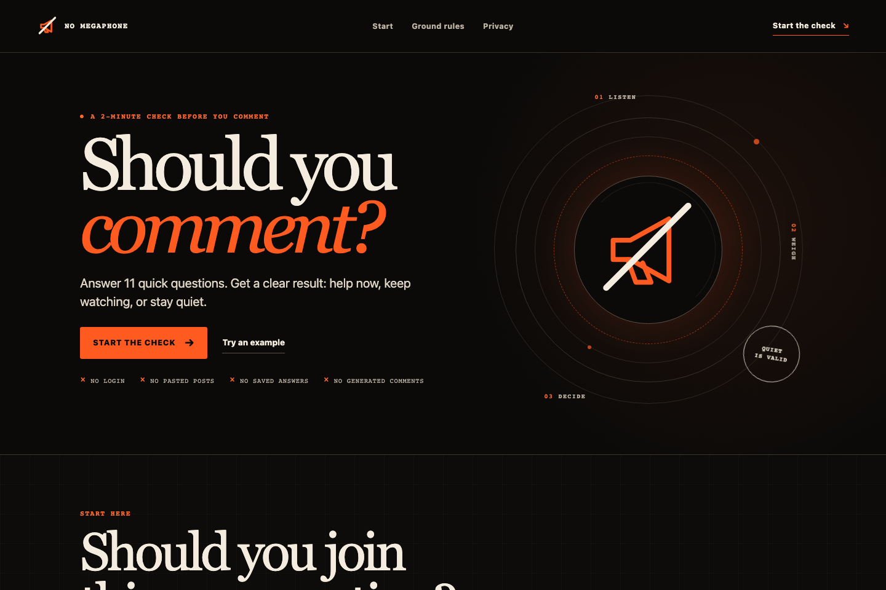
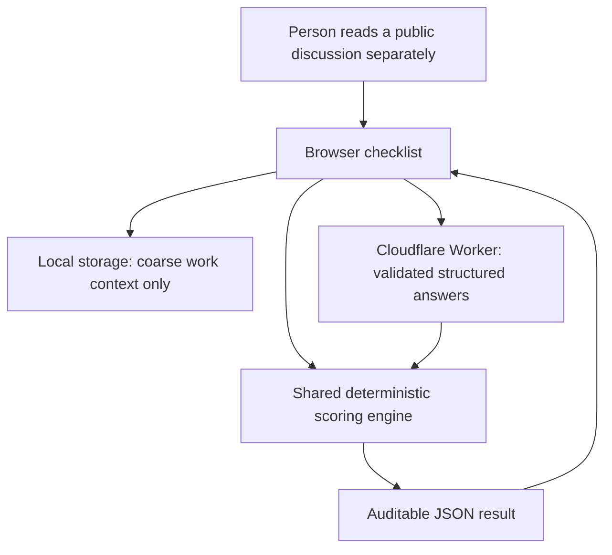

# NO MEGAPHONE

> **Should you comment?**
>
> A two-minute check before you join a public conversation.

**[Open the live build →](https://no-megaphone.recruiting-gains.workers.dev/)**


*The point is not to say more. It is to decide whether saying anything would help.*

NO MEGAPHONE is a respectful, read-only decision tool. Eleven quick questions produce a clear result before someone enters a public online community discussion.

The person reads the discussion in another tab. The app never opens the page, asks for its link, connects to an account, or writes a comment. “Stay quiet” is treated as a successful result.

## See the real interface



## A two-minute demo

1. Read a public community discussion yourself.
2. Answer eleven quick questions about need, rules, timing, experience, and intent.
3. Get a transparent score and next step—or accept **Stay quiet** as the completed decision.

The built-in example is fictional. It produces 87/100 rather than a perfect showcase score, including a conditional community-rule fit that requires disclosure.

## What it will not do

- No social-platform API, scraping, crawling, page reading, or browser automation
- No account connection, posting, commenting, voting, messaging, or direct messages
- No generated comments, promotional copy, or outreach messages
- No usernames, identity profiling, discussion URLs, private information, or free-text discussion input
- No promise of customers, traffic, trust, leads, sales, or visibility
- No database and no application-created checklist-answer history
- No affiliation with any social platform, online community, or community operator

## How it works



There is deliberately no arrow from the application to a community or social platform.

### Architecture

| Layer | Responsibility |
| --- | --- |
| `index.html` + `src/client/` | Editorial landing page, local-only context, manual checklist, fictional demo, resilient result UI, and delete/reset controls |
| `src/shared/contracts.ts` | Closed request/response types and request-size limit |
| `src/shared/validation.ts` | Strict allowlist validation; missing, unknown, or extra fields are rejected |
| `src/shared/scoring.ts` | Pure deterministic formula used by both browser and Worker |
| `src/worker/index.ts` | `/api/health`, `/api/score`, consistent JSON errors, origin checks, bounded body reader, deep-link redirects, and security headers |
| `wrangler.jsonc` | Cloudflare Worker and static-assets configuration; no database, secret, AI, or production route |

The browser calculates the published formula locally and asks the Worker to verify it. Verification is bounded to four seconds, and controls that could change the submitted snapshot are locked while it is pending. If the endpoint fails or misses that deadline, the same imported formula returns a result and the interface says that it ran locally.

## Contribution Opportunity Score 1.0

Seven positive factors total 100 points:

| Factor | Maximum | Why it matters |
| --- | ---: | --- |
| Helpfulness gap | 24 | A specific, unresolved need matters more than an opening for attention. |
| Community-rule fit | 22 | The room’s rules are decisive. |
| Business relevance | 16 | Firsthand work should match the actual question. |
| Trust opportunity | 12 | Specific experience and honest disclosure make a perspective more useful. |
| Conversation momentum | 10 | An early, unsaturated discussion has more room than a crowded one. |
| Freshness | 8 | Old discussions may no longer need another answer. |
| Geographic fit | 8 | Local knowledge matters only when place affects the question. |

### Labels

| Final score | Label |
| ---: | --- |
| 75–100 | Helpful opening |
| 55–74 | Worth reading |
| 35–54 | Observe |
| 0–34 | Stay quiet |

### Penalties

| Condition | Points |
| --- | ---: |
| Saturated conversation | −18 |
| Mixed helpful/promotional intent | −20 |
| Help only partly stands on its own | −8 |
| Useful value requires a click or contact | −25 |
| Important context gaps | −12 |

### Caps and exclusions

- **Final score 0:** rules prohibit business participation, the topic is sensitive/high-stakes, promotion is the primary intent, or information is insufficient.
- **Cap at 34:** rules are unknown, there is no helpfulness gap, sensitivity is unclear, or value requires a click/contact.
- **Cap at 54:** the need is already met or important context is incomplete.

The result exposes base points, every subtraction, the pre-guardrail score, final score, active guardrails, and uncertainty reasons. There is no machine-learning score.

## Privacy and security

The application accepts eleven enumerated checklist values. It has no field for a post, URL, username, name, email, message, or free text.

Broad work type, experience range, and geographic scope can be stored under one versioned `localStorage` key. That context is not scored or sent to the Worker. The setup form is revealed only after its local handlers are ready, and its controls are excluded from native form submission so a no-script or failed-initialization page cannot put that context in a request URL. **Delete local data** removes it and resets the current check.

The Worker:

- caps request bodies at 4 KiB, including streamed bodies;
- requires an exact JSON media type and a closed field allowlist;
- rejects cross-origin score requests;
- emits consistent, non-leaking JSON errors with generated request IDs;
- returns full document security headers plus restrictive CSP, referrer, MIME, and resource-isolation headers on JSON API responses;
- has Cloudflare observability disabled in configuration; and
- binds no database or persistent storage.

A future hosting provider may still process standard security and operational metadata under its own policies. The application itself creates no checklist-answer history.

## Accessibility and resilience

- Semantic headings, landmarks, forms, fieldsets, legends, lists, tables, status text, and dialog naming
- Visible skip link and focus rings; the full setup/checklist path works by keyboard
- Zero Axe violations in the final automated Chromium scan
- Contrast fixes verified against WCAG AA checks
- `prefers-reduced-motion` fallback for all motion and scrolling
- Responsive landing and completed-result checks at 320, 390, 768, and 1440 px
- A full animation-cycle overflow check at mobile width
- Readable product philosophy, rules, scoring weights, and privacy information without JavaScript
- Four-second deadline with deterministic local fallback, plus a locked pending snapshot so answers cannot change while that result is being computed
- Direct links for `/read-the-room`, `/rules-first`, and `/privacy`

Automated evidence does not replace testing with people who use assistive technology. See the proposed genuine study in [`docs/BLINDED-EVALUATION.md`](./docs/BLINDED-EVALUATION.md).

## Local development

Requirements: Node.js 22 or newer and npm (matching the locked Wrangler release).

```bash
cd no-megaphone
npm ci
npx playwright install chromium
npm run dev
```

Open `http://127.0.0.1:8787`. The development command builds the front end and runs the local Cloudflare Worker. No Cloudflare account or secret is required for the current app.

## Tests

```bash
npm run lint
npm run typecheck
npm test
npm test -- --coverage
npm run test:e2e
npm run build
npm run deploy:check
```

`npm run check` runs the complete gate in order. Browser tests execute the bundled Worker handler against production assets through a network-isolated local adapter. Set `CHROMIUM_EXECUTABLE_PATH` when CI already supplies a compatible Chromium executable.

Final recorded evidence is in [`docs/VERIFICATION.md`](./docs/VERIFICATION.md). The adversarial review and simulated comparison are in [`docs/THE-OPPONENT.md`](./docs/THE-OPPONENT.md) and [`docs/BLINDED-EVALUATION.md`](./docs/BLINDED-EVALUATION.md).

## Live deployment

**Production:** <https://no-megaphone.recruiting-gains.workers.dev/>

The public build is live on Cloudflare Workers. No deployment is performed by this documentation update.

For a future release:

1. Run `npm ci` and `npm run check` from this folder.
2. Review the output of `npm run deploy:check`.
3. Deploy only after reviewing the change.
4. Verify `/api/health`, the fictional journey, security headers, and mobile layout.

The configuration creates no database binding, secret, AI binding, custom domain, or platform connection.

## Honest limitations

- Inputs are self-reported observations. The app cannot verify a discussion, its rules, or a person’s experience because it deliberately never reads the source.
- The score supports judgment; it cannot establish whether participation is welcome or correct.
- The local fallback confirms resilience, not server availability.
- Current performance numbers come from a local production build, not field data over a public network.
- No genuine human blinded study has been run. The included comparison is explicitly simulated and heuristic.
- Localization and testing with assistive-technology users remain future work.
- Future releases should recheck host-level abuse controls and the hosting provider’s metadata policy.

## License and independence

This folder is covered by the parent repository’s existing [MIT License](../LICENSE). No separate license was added.

NO MEGAPHONE is an independent project. It is not affiliated with or endorsed by any social platform, online community, or community operator.
