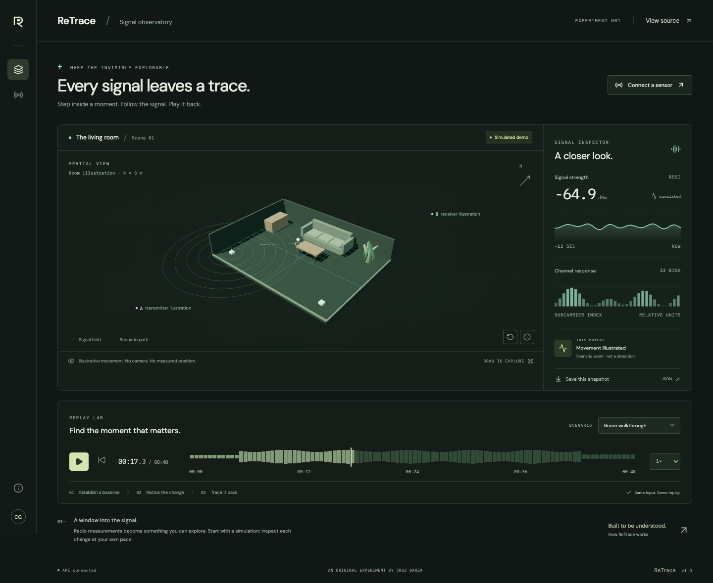
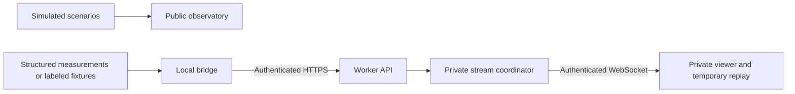

# ReTrace — Signal Observatory

An interactive place to explore changing signals, inspect a moment, and play it back.

[Open ReTrace](https://retrace.recruiting-gains.workers.dev/) · [Watch the tour](https://retrace.recruiting-gains.workers.dev/media/ReTrace-landscape.mp4) · [Portrait video](https://retrace.recruiting-gains.workers.dev/media/ReTrace-portrait.mp4) · [What was tested](docs/VERIFICATION.md) · [Connect a sensor bridge](docs/SENSOR-CONTRACT.md)



## Try it

Choose one of five scenarios, play or pause, then move the timeline to inspect a change. Save a labeled JSON snapshot. Drag the room to change the view, or use its reset button. The app includes a 2D fallback, reduced-motion support, keyboard controls, and responsive phone layouts.

**The public observatory uses deterministic simulated data.** The room and its moving marker are illustrations. They are not measured positions, camera footage, or evidence of Wi-Fi sensing. ReTrace does not infer occupancy, poses, identities, or vital signs.

The private connection interface is implemented: a local NDJSON bridge can submit structured RSSI or CSI amplitude measurements to an authenticated Cloudflare service. A temporary browser buffer supports replay without changing the data's source label. Device drivers, calibration, and inference models are outside v1. Protocol fixtures test the connection; no physical sensing hardware has been validated.

## Run locally

Use Node.js 24 or newer.

```sh
npm ci
npm run build
npm run preview
```

Open the local address printed by Wrangler. For frontend development, run `npm run dev` in a second terminal while the Worker is running. The UI has a bundled demo if the API is unavailable and labels that state.

To enable the private stream, create an ignored `.dev.vars` with three different cryptographically random values of at least 32 characters: `INGEST_SECRET`, `VIEWER_SECRET`, and `SESSION_SECRET`. Never put actual keys in source, screenshots, or URLs. See the [sensor contract](docs/SENSOR-CONTRACT.md) for the bridge, authentication, bounds, and lifecycle behavior.

## Architecture

- **Interface:** React, TypeScript, Vite, and original procedural Three.js geometry.
- **Demo:** Shared deterministic scenario functions used by the browser and public API.
- **Backend:** A Cloudflare Worker with static assets, public scenario routes, signed viewer sessions, and authenticated ingestion.
- **Private stream:** One Durable Object coordinates a single private room, with hibernatable WebSockets and bounded flow control. It stores control metadata only, never measurements.
- **Bridge:** A Node/TypeScript NDJSON reader with stable session/sequence identity and finite retries.



Source kind and playback mode are separate. Missing measurements remain unavailable. Each trace belongs to one sensor and session. Stale data is labeled; disconnects and restarts never become empty-room claims or simulated replacement data.

## Verify

```sh
npm run typecheck
npm test
npm run test:worker
npm run build
npm run test:e2e
npm run check:deploy
npm audit --audit-level=moderate --ignore-scripts
```

Browser checks use installed Chrome by default. Set `PLAYWRIGHT_CHANNEL=chromium` after `npx playwright install chromium` for the CI browser. Runtime verification runs isolated workerd instances and temporary fixtures; it never writes to production. The [verification record](docs/VERIFICATION.md) distinguishes those tests from deployed checks and untested hardware.

## Deploy

Authenticate Wrangler for the intended Cloudflare account. Review `wrangler.jsonc`, then run `npm run deploy`. Upload the three private-stream secrets through Wrangler's secret input or a protected secrets file. The configuration creates the `retrace` Worker and its `SignalRoom` Durable Object migration. Missing or reused secrets disable private endpoints; the public demo remains available.

The finished tour files are release assets, excluded from Git. Run `npm run media:fetch` before building a release to download and verify the published MP4s against `public/media/manifest.json`. See [media notes](docs/MEDIA.md).

Deployment is explicit. GitHub Actions runs checks; it does not silently deploy another project's resources. A code rollback does not roll back Durable Object control metadata.

## Reference and authorship

ReTrace is an original implementation inspired by studying [RuView](https://github.com/ruvnet/RuView). Its application code, visual identity, procedural room, and demo scenarios were written independently. It does not ship RuView firmware, model weights, or sensing algorithms. See the [source analysis](docs/REFERENCE-ANALYSIS.md) for the inspected commit, architecture, and evidence boundaries.

AI-assisted development. This experiment is independent of RuView, Cloudflare, OpenAI, and Runway. The showcase repository's MIT license applies. Third-party packages retain their own licenses.
