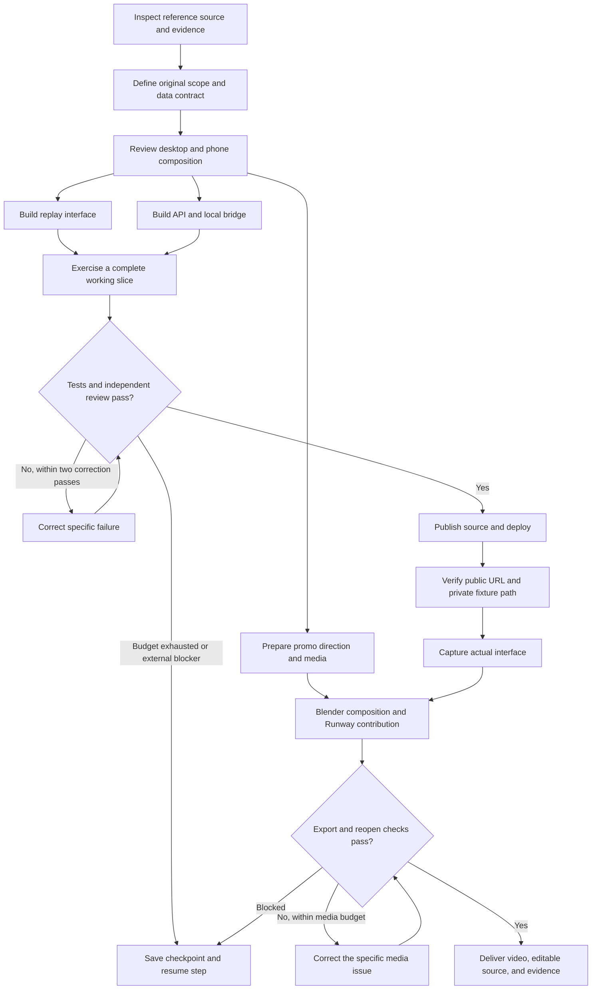

# Build workflow

This graph records the development process, not a permanent agent service or scheduler shipped in the product.

Frontend, backend, and media have separate owners. Shared resources have one writer at a time. Review is independent of implementation. Checkpoints record versions, observed outcomes, budgets, and exact resume steps; they exclude credentials and private reasoning.

Agent-checked limits for this run: application four hours/120 action groups, release one hour/30 groups, media two hours/60 groups; two corrective passes per phase. Media uses no more than 200 existing Runway credits, two visual candidates, two narration takes, and one music generation. Limits are workflow procedures, not runtime guarantees.
